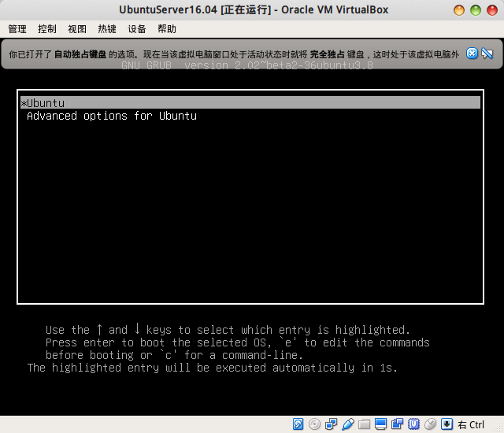
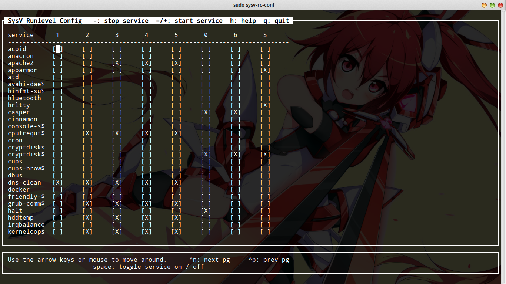
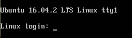

# Linux系统启动过程

本篇笔记详细记录了Linux操作系统，从按下计算机电源到出现登录提示符的详细启动过程。不同的Linux发行版，新版本和旧版本Linux，或多或少有些区别。这里我们以Ubuntu 14.04为例，介绍Linux操作系统的启动过程。

## 硬件初始化和加载BIOS程序

不管电脑上是否安装了操作系统，按下电源按钮，默认都会初始化硬件，并加载BIOS程序。这和Linux关系不大，我们就不在这里详细叙述了。

## 读取并执行引导扇区

学过操作系统都知道，磁盘上的0磁道，1扇区叫做引导扇区，我们需要在这512B空间内，编写加载操作系统内核的16位汇编程序，计算机启动时，会自动读取这个扇区的内容到内存地址0x7c00并执行。

当然，操作系统发展到今天，已经不是由引导扇区代码直接加载Linux内核了，而是由其加载grub程序（Bootloader，除了grub还有Lilo等，但不常用），再由grub程序加载Linux内核。我们开机后，通常会出现一个选择界面，我们可以选择正常启动操作系统，或是以恢复模式启动操作系统，实际上当前正在运行着的，和我们交互的程序就是grub程序。



## 加载内核

加载内核的工作由grub程序完成。在此之前，grub会设置一系列寄存器，使计算机进入保护模式（32位）或者长模式（64位），最终grub会从磁盘上读取内核程序，并载入内存，然后将CPU交给Linux内核。

## 启动init进程

init是Linux启动后的第一个用户态进程。该程序的可执行文件在`/sbin/init`，这个init进程会读取`/etc/init`下的所有配置文件，并据此初始化我们计算机的服务程序等。

下面是一个init配置文件的例子

mongod.conf
```shell
# Ubuntu upstart file at /etc/init/mongod.conf

# Recommended ulimit values for mongod or mongos
# See http://docs.mongodb.org/manual/reference/ulimit/#recommended-settings
#
limit fsize unlimited unlimited
limit cpu unlimited unlimited
limit as unlimited unlimited
limit nofile 64000 64000
limit rss unlimited unlimited
limit nproc 64000 64000

kill timeout 300 # wait 300s between SIGTERM and SIGKILL.

pre-start script
  DAEMONUSER=${DAEMONUSER:-mongodb}
  if [ ! -d /var/lib/mongodb ]; then
    mkdir -p /var/lib/mongodb && chown mongodb:mongodb /var/lib/mongodb
  fi
  if [ ! -d /var/log/mongodb ]; then
    mkdir -p /var/log/mongodb && chown mongodb:mongodb /var/log/mongodb
  fi
  touch /var/run/mongodb.pid
  chown $DAEMONUSER /var/run/mongodb.pid
end script

#start on runlevel [2345]
#stop on runlevel [06]
stop on runlevel [023456]

script
  ENABLE_MONGOD="yes"
  CONF=/etc/mongod.conf
  DAEMON=/usr/bin/mongod
  DAEMONUSER=${DAEMONUSER:-mongodb}
  DAEMONGROUP=${DAEMONGROUP:-mongodb}

  if [ -f /etc/default/mongod ]; then . /etc/default/mongod; fi

  # Handle NUMA access to CPUs (SERVER-3574)
  # This verifies the existence of numactl as well as testing that the command works
  NUMACTL_ARGS="--interleave=all"
  if which numactl >/dev/null 2>/dev/null && numactl $NUMACTL_ARGS ls / >/dev/null 2>/dev/null
  then
    NUMACTL="$(which numactl) -- $NUMACTL_ARGS"
    DAEMON_OPTS=${DAEMON_OPTS:-"--config $CONF"}
  else
    NUMACTL=""
    DAEMON_OPTS="-- "${DAEMON_OPTS:-"--config $CONF"}
  fi

  if [ "x$ENABLE_MONGOD" = "xyes" ]
  then
    exec start-stop-daemon --start \
        --chuid $DAEMONUSER:$DAEMONGROUP \
        --pidfile /var/run/mongodb.pid \
        --make-pidfile \
        --exec $NUMACTL $DAEMON $DAEMON_OPTS
  fi
end script
```

注意`stop on runlevel [023456]`，这个是我自己加上去的。因为我的电脑只是开发用的工作站，而不是服务器，我不希望开机启动`mongod`服务，所以注释掉了上面两行，并添加了这一行。

这个`conf`实际上是一个shell脚本，大部分内容都好理解，但是`runlevel`究竟是什么呢？

### run level

Linux系统有7个运行级别：

* 0级：系统停机状态，系统默认运行级别不能为0
* 1级：单用户工作状态
* 2级：多用户状态，没有NFS
* 3级：多用户状态，有NFS，登陆后进入终端命令提示符
* 4级：未使用，保留
* 5级：X11图形界面
* 6级：系统正常关闭并重启，默认运行级别不能设置为6

尽管理论上如此（Redhat系列应该是上面这样的），但是实际上Debian系列系统的runlevel是这样的：

* 0级：停机
* 1级：单用户
* 2级：带X11图形界面的全功能多用户工作状态
* 3级：带X11图形界面的全功能多用户工作状态
* 4级：带X11图形界面的全功能多用户工作状态
* 5级：带X11图形界面的全功能多用户工作状态
* 6级：重启

默认情况下，Debian系统的运行级别2-5没有区别。我们可以在`etc`下建立`inittab`文件修改默认的runlevel，当然通常我们不会这么做。

说白了，runlevel定义了操作系统要进入的运行状态，默认情况下，我们正常开机，就会进入runlevel 2-5。`/etc/init`下的配置文件，就会根据对应的runlevel配置，决定是否启动某个服务。

## 加载内核模块

这一步就是根据`/etc/modules`和`/etc/modules.d/`下的配置文件加载内核模块。

## 执行不同运行级别的脚本程序

`/etc`下，有`rc0.d`到`rc6.d`文件夹，里面存放了很多软链接，指向一些脚本文件，这里实际上也要用到`runlevel`，根据操作系统对应的runlevel，执行对应文件夹内的脚本程序，完成初始化。

刚才，我们观察了`/etc/init/mongod.conf`，里面我们为了防止mongodb开机启动，修改了其`start/stop on runlevel...`，但是大多数服务不是在`/etc/init`下插入启动脚本的，而是在`rcX.d`下，比如apache2。这就稍稍造成了一点混乱，`rcX.d`下的服务，我们可以使用`sysv-rc-conf`工具进行配置，但某些程序并没有使用`rcX.d`，比如mongodb，此时我们就应该想到`/etc/init`。

sysv-rc-conf工具



## 执行rc.local

执行`/etc/rc.local`，这个文件就是给用户用的，我们需要操作系统在开机时干什么，写入`rc.local`就好了。里面默认没有内容。

## 显示登录提示符

最后一步就是执行`/bin/login`，这个程序会显示一个登录提示符，我们正常登陆后，就能够使用bash shell程序，控制我们的操作系统了。


