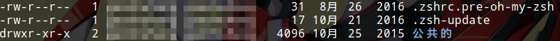
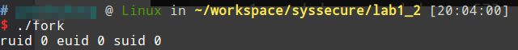

# 用户/用户组 UID/GID

Unix/Linux是多用户操作系统，多用户存在就会产生权限和安全问题。Linux中，每一个用户都对应一个UID，UID用来唯一标识一个用户。所谓的用户，不是坐在终端前操作电脑的人，而是一个进程的权限的抽象。当然，操作电脑的那个人也需要一个用户账号来使用shell。

* UID 0 root用户，root用户拥有操作系统的最高权限
* UID 0-999 系统用户，系统中重要服务所属的用户，默认限制登录
* UID 1000和以上 管理员创建的用于日常工作的普通用户，我们安装Linux时，创建了一个我们自己的账户，通常情况下这个账户的UID恰好是1000

除了用户之外，还有用户组的概念，通过组来分配权限结构更清晰，使用更方便。GID表示用户组ID，用来唯一标识一个用户组。

`/etc/passwd`存储了所有用户的信息，`/etc/group`存储了所有用户组的信息。我们可以使用`cat`等命令进行查看。或者使用`id <username>`命令进行查看。

## 配置用户和用户组

```shell
# 添加用户
adduser testuser

# 添加用户组
addgroup testgroup

# 设置/重置用户密码
passwd testuser

#添加用户到用户组
usermod -G testgroup testuser

#删除用户
userdel testuser

#删除用户组
groupdel testgroup
```

# 文件的权限归属

用户对应进程，进程操作数据。Linux中一切（数据）都是文件，多用户下，文件就有权限归属问题。

## 读 写 可执行

我们使用`ls -al`可以看到文件的详细权限信息。



第一位d表示这个文件是一个目录，-标识普通文件，通常还会见到c，表示是设备文件。

后面是三组rwx，其中r表示读权限，w表示写权限，x表示可执行权限，如果没有改权限，就用-表示。其中第一组表示文件拥有者用户的权限，第二组表示文件的用户组权限，第三组表示其他所有用户的权限。

紧接着的就是用户名和用户组归属了。

### 更改读写权限

```shell
chmod +w a.txt
chmod 755 executable
```

上面演示了chmod的两种用法，第一种可以通过加减`r w x`配置权限，也可以通过掩码进行配置。例如755对应`rwxr-xr-x`。

### 更改文件的用户和用户组

```shell
chown testuser a.txt
chgrp testuser a.txt
```

上面两条命令能够更改用户和用户组归属，十分简单。

读写权限理解起来非常简单，但是实际使用中还是需要注意合理的配置权限。比如：考虑把一类文件和另一个些用户共享，不要直接`chmod 777`或者`chmod 666`，应该首先考虑是否能用用户组解决这个问题，分配给其他用户读权限还是读写权限。

* `-R` 选项：`chmod chown chgrp`使用该选项可以递归更改权限，这个非常常用。
* `chown owner:group file` chown可以同时改变用户和用户组，非常方便。

# euid ruid suid

* ruid：real user id 进程拥有者的id，用户登陆后，这个id就唯一确定了
* euid：effective user id 访问控制时读读取的id，通常情况下等于ruid，但是有些情况下不一样（后面详细解释）
* suid：saved user id 保存到文件的访问权限控制id，用于控制对该文件的访问

通常情况下，我们以普通用户身份登录，例如以一个uid=1000的用户登录，此时该用户运行一个可执行文件，该可执行文件归属可以不是该用户，但是该用户具有可执行权限，进程ruid=euid=suid=1000。如果是root用户则全是0。

但是有些需求下，就不同了。最明显的例子是passwd程序。我们的密码存放在一个叫shadow的文本文件中，该文件的权限是`rw------- root root`，也就是说只有root才能访问和修改这个文件。但是我们知道，所有用户都可以运行passwd修改自己的密码，间接访问了shadow，这是怎样做到的呢？

其实，passwd具有可执行的s权限。这个权限可以提升进程的权限到可执行文件拥有者，因此运行passwd可以修改shadow，但是shadow这个可执行程序本身不能被非root用户修改，而程序内部判断了非root用户修改的是否是自己的密码，因此既保证了shadow文件的安全又实现了任何非root用户可以修改自己密码的需求。实际上，s也是一种可执行权限，但是是在x的基础上更进一步，能够允许用户提升到该文件所有者的权限，访问该文件所有者用户才能访问的文件。

对可执行程序附加s权限：`chmod +s`。

## 编写一个简单的passwd

passwd.c
```c
#include <stdio.h>
#include <stdlib.h>
#include <unistd.h>
#include <string.h>
#include <openssl/sha.h>

void sha256(const unsigned char *src, char *buf);

int main(int argc, char **argv)
{
	if(argc != 2)
	{
		printf("Usage:\n");
		printf("mypasswd <username>\n");
		exit(1);
	}


	int uid = getuid();
	char uidStr[10];
	sprintf(uidStr, "%d", uid);

	FILE *shadow = fopen("shadow", "r+");
	if(shadow == NULL)
	{
		fprintf(stderr, "can not open shadow file\n");
		exit(1);
	}

	char uidArr[100][100];
	char usernameArr[100][100];
	char passwordArr[100][100];

	int cur = 0;
	while(!feof(shadow))
	{
		fscanf(shadow, "%s", uidArr[cur]);
		fscanf(shadow, "%s", usernameArr[cur]);

		if(!strcmp(usernameArr[cur], argv[1]))
		{

			if(uid != 0 && strcmp(uidArr[cur], uidStr))
			{
				fprintf(stderr, "permission denied\n");
				exit(1);
			}

			printf("Input new password:\n");
			char newPassword[100];
			scanf("%s", newPassword);

			char buf[100];
			sha256(newPassword, buf);
			strcpy(passwordArr[cur], buf);

			char temp[100];
			fscanf(shadow, "%s", temp);
		}
		else
		{
			fscanf(shadow, "%s", passwordArr[cur]);
		}
		cur++;
	}

	fseek(shadow, 0, SEEK_SET);

	for(int i = 0; i < cur; i++)
	{
		fprintf(shadow, "%s %s %s\n", uidArr[i], usernameArr[i], passwordArr[i]);
	}

	fclose(shadow);

	return 0;
}

void sha256(const unsigned char *src, char *buf)
{
	unsigned char md[33] = {0};
	SHA256(src, strlen((const char *) src), md);

	int i = 0;
	char tmp[3] = {0};
	for(i = 0; i < 32; i++ )
	{
		sprintf(tmp,"%02X", md[i]);
		strcat(buf, tmp);
	}
	strcat(buf, "\0");
}
```

shadow
```
0 root 8D969EEF6ECAD3C29A3A629280E686CF0C3F5D5A86AFF3CA12020C923ADC6C92
1 test1 8D969EEF6ECAD3C29A3A629280E686CF0C3F5D5A86AFF3CA12020C923ADC6C92
2 test2 8D969EEF6ECAD3C29A3A629280E686CF0C3F5D5A86AFF3CA12020C923ADC6C92
1000 ciyaz 8BB0CF6EB9B17D0F7D22B456F121257DC1254E1F01665370476383EA776DF414
```

shadow文件比较简单，第一列是用户uid，第二列是用户名，第三列是密码的SHA-256散列值。

## passwd和shadow的权限


这样，普通用户由于也具有可执行权限，因此可以运行该程序修改存储于shadow文件的自己的密码。但普通用户修改别人的密码就会提示`permission denied`，这是程序内部判断实现的，root用户则能修改所有人的密码。

普通用户没有passwd程序的写权限，因此不能修改这个程序的判断逻辑。

# fork和execl进程的权限

首先要弄清楚两个函数的机制，fork复制当前进程创建子进程，execl将当前进程上下文直接切换，加载某个可执行文件并执行。

对于`fork()`如果我们在子进程使用`setuid()`提升权限，并且该可执行文件具有s权限，那么子进程是可以成功提升权限的。对于`execl()`系列函数，即使被execl入口的可执行文件具有s权限，但execl加载的可执行文件不具备该权限，也不能提升权限。

这里我们使用两个例子进行说明。

## fork

```c
#include <unistd.h>
#include <sys/types.h>
#include <sys/wait.h>
#include <stdio.h>
#include <stdlib.h>

void printresuid();

int main()
{
	pid_t pid;
	pid = fork();

	if(pid < 0)
	{
		perror("fork");
		exit(1);
	}
	else if(pid == 0)
	{
		if(setresuid(0, 0, 0) < 0)
		{
			perror("setresuid");
			exit(1);
		}
		printresuid();
	}
	else
	{
		int stat_val;
		waitpid(pid, &stat_val, 0);
	}
}
void printresuid()
{
	uid_t ruid, euid, suid;
	if(getresuid(&ruid, &euid, &suid))
	{
		perror("getresuid()");
		exit(1);
	}
	printf("ruid %d euid %d suid %d\n", ruid, euid, suid);
}
```

我们在子进程中，使用`setresuid()`把ruid euid suid全部更改为root用户。

可执行文件的权限：


使用普通用户运行：



权限提升成功了。

## execl

exec.c
```c
#include <unistd.h>
#include <stdio.h>

int main()
{
	execl("./exec-target","exec-target", NULL);
	return 0;
}
```

exec_target.c
```c
#include <unistd.h>
#include <stdio.h>
#include <stdlib.h>
void printresuid();
int main()
{
	if(setresuid(0, 0, 0) < 0)
	{
		perror("setresuid");
		exit(1);
	}
	printresuid();
	return 0;
}
void printresuid()
{
	uid_t ruid, euid, suid;
	if(getresuid(&ruid, &euid, &suid))
	{
		perror("getresuid()");
		exit(1);
	}
	printf("ruid %d euid %d suid %d\n", ruid, euid, suid);
}
```

我们在被execl加载的可执行文件中，使用`setresuid()`提升为root权限。

可执行文件权限：


使用普通用户运行：


可以看到执行成功了。

如果我们把`exec-target`的s权限去掉就不行了。此时即使`exec`具有s权限，甚至所属用户是root也都是不行的。
