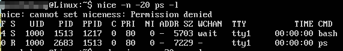
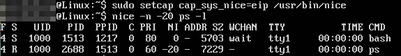

# capability

不同于传统*nix的DAC权限控制，linux引入了能力位（capability）。它可以作用在进程或可执行文件上，为其赋予特殊的权限。具体所有的可配置能力位，请参考手册。下面只是举几个例子，展示一下能力位配置的用法。

## cap_chown

该能力允许任何用户改变文件归属。例如：我们有一个root:root归属的文件。

普通用户使用chown更改其权限被拒绝

设置能力位，普通用户执行chown更改root的文件的归属成功

使用getcap查看

## cap_sys_nice

设置该能力位允许调整进程优先级。我们调整一下自己bash进程的优先级，当以普通用户执行时被拒绝：

设置一下nice程序的cap_sys_nice，重新运行：

可以看到优先级提高了。

## cap_dac_override

设置该能力位允许用户绕过DAC控制。创建一个文件归属是root的文件a.txt，普通用户使用vim修改，提示不能保存

对vim程序添加能力位

普通用户用vim可以修改这个文件了

注：vim还是认为这个文件是只读的，所以用w!强制保存就可以了
