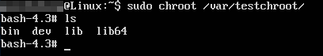
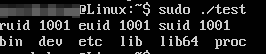
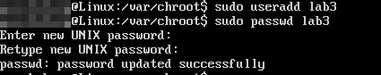
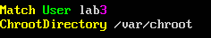
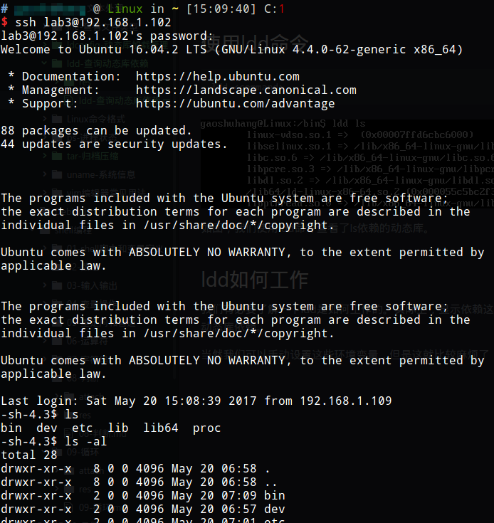

# chroot隔离环境配置

## 什么是chroot

change root，字面意思是改变程序运行时的根目录。我们的系统有一个根目录`/`，里面包含了可执行文件`/bin`，共享库文件`/lib`等等，这些都是系统中的重要文件。一个用户登入我们的系统，一定程度上这个用户就能访问系统中的关键文件，比如执行`ls`命令，实际上就是执行的`/bin/ls`。再比如另一个用户通过ssh登录系统，他也是能够访问系统关键文件的。虽然我们通过严格的读/写/执行/归属权限配置，能够解决大部分安全问题，但是这可能会出现漏洞。

chroot能够创建一个虚拟环境，举个例子：一个系统管理员指定目录`/var/chroot`作为虚拟环境的`/`，用户登入虚拟环境看到的根目录就是它，但实际上这个目录位于整个系统的`/var/chroot`，用户却无法逃出他看到的`/`。这就是chroot的作用。

我们把sshd的某个用户配置为使用chroot环境，他就只能在chroot环境里执行有限的操作。对于其他服务，也可以进行类似操作，如果某个服务有漏洞遭到攻击，黑客很可能也仅仅能够到达chroot目录的根，而无法破坏整个系统。

## chroot环境搭建

我们需要创建一个目录作为chroot根，然后拷贝一些必要的可执行文件，共享库文件等。我们可以手动来，但是比较麻烦。下面是一个创建chroot环境的脚本：

```shell
#!/bin/bash

cmdlist="/bin/bash /bin/ls"

chroot_path=$1

lib_loc_1=`ldd $cmdlist | awk '{ print $1 }' | grep "/lib" | sort | uniq`
lib_loc_2=`ldd $cmdlist | awk '{ print $3 }' | grep "/lib" | sort | uniq`

for i in $cmdlist
do
	if [ ! -d `dirname ${chroot_path}$i` ];
	then
		mkdir -p `dirname ${chroot_path}$i`
	fi
	cp -a $i ${chroot_path}$i && echo "$i done"
done

for j in $lib_loc_1
do
	if [ ! -d `dirname ${chroot_path}$j` ];
	then
		mkdir -p `dirname ${chroot_path}$j`
	fi
	cp -f $j ${chroot_path}$j && echo "$j done"
done

for k in $lib_loc_2
do
	if [ ! -d `dirname ${chroot_path}$k` ];
	then
		mkdir -p `dirname ${chroot_path}$k`
	fi
	cp -f $k ${chroot_path}$k && echo "$k done"
done
cd ${chroot_path}
mkdir dev
mknod dev/null c 1 3
mknod dev/zero c 1 5
mknod dev/random c 1 8
mknod dev/urandom c 1 9
mknod dev/tty c 5 0
ln -s bin/bash bin/sh
```

其原理就是利用`ldd`工具，找出我们chroot环境中需要的可执行文件依赖的动态共享库，并复制到chroot目录中。这里我们配置了`bash`程序和`ls`程序。除此之外，还创建了一些必要的设备文件等。


我们需要使用root权限执行。



如图所示，这个基本的chroot环境就搭建起来了，我们使用`chroot`命令进入这个环境即可。即使我们`cd /`，也只能在chroot环境中，不能够出去。

## 降低进入chroot环境后的权限

我们使用`sudo chroot /var/testchroot/`进入虚拟环境，但我们的权限还是root，这太危险了。我们必须以普通用户身份进入chroot环境才行。

```
chroot --userspec=USER:GROUP <path>
```

我们可以使用`--userspec`指定了切换到虚拟环境后的用户和用户组。

除此之外，我们的c程序还能通过`setuid()`系列函数降低自己的权限。

例子：

```c
#include <stdio.h>
#include <stdlib.h>
#include <unistd.h>
#include <sys/wait.h>
#include <sys/types.h>

int main(void)
{
	chdir("/var/chroot/");
	chroot("/var/chroot/");
	if(setresuid(1001, 1001, 1001) < 0)
	{
		perror("setresuid");
		exit(1);
	}

	pid_t pid;
	pid = fork();
	if(pid < 0)
	{
		perror("fork");
		exit(1);
	}
	else if(pid == 0)
	{
		execl("/bin/ls", "ls", NULL);
	}
	else
	{
		uid_t ruid, euid, suid;
		if(getresuid(&ruid, &euid, &suid))
		{
			perror("getresuid");
		}

		printf("ruid %d euid %d suid %d\n", ruid, euid, suid);
		int stat_val;
		waitpid(pid, &stat_val, 0);
	}
	return 0;
}
```



该程序fork执行了`ls`命令，证明自己在虚拟环境中，同时输出`ruid euid suid`证明自己的权限不是root。

注意：程序在执行`chroot()`前，必须`chdir()`，否则根目录不会切到虚拟环境。那就很危险了。

## 对ssh配置chroot虚拟环境

首先我们需要创建一个用户，将它用作ssh登入虚拟环境专用的用户。



然后修改配置文件`/etc/ssh/sshd_config`，在最后加上如图的内容：



重启服务器后，我们使用另一台电脑登录该主机ssh服务器的lab3账户：



lab3账户被限制在了虚拟环境中。

对于其他服务，也提供了一些类似的配置，保证其在安全的环境中运行。

## chroot的其他用法

chroot不仅能用来安全隔离，实际上在安装操作系统时，也可以用来搭建基础环境。当初我尝试安装`Arch Linux`时就曾用到，只是当时不太明白chroot的作用，现在终于弄懂了，这里就不详细介绍了。
