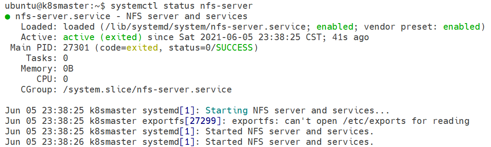
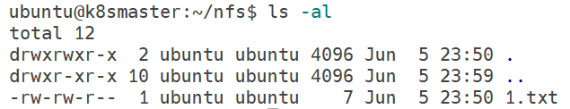

# nfs-网络文件系统

Network File System（NFS）是SUN公司开发的一种文件共享协议，客户端能够挂载nfs服务器共享的文件目录，稳定可靠、使用简单，功能类似samba，但使用场景完全不同。

同类技术比较：

* nfs：常用于Linux服务器内网环境，供应用服务器挂载存储服务器的目录
* samba：常用于日常办公环境，实现局域网文件、打印机共享等功能
* WebDAV：可以看作是网盘的通用API接口，一般用于公网环境分享文件

注：Windows系统普遍支持samba、WebDAV，但只有Windows7旗舰版、Windows10专业版才支持nfs客户端，家庭版用户都不支持该功能。

## 安装nfs

这里以Ubuntu系统为例，我们直接从apt源中安装即可：

```
apt-get install nfs-kernel-server nfs-common
```

* `nfs-kernel-server`：nfs服务端（客户端不必安装）
* `nfs-common`：nfs客户端

安装好后，我们可以通过`systemd`查看nfs服务的状态：

```
systemctl status nfs-server
```



## nfs目录配置

nfs服务的配置文件为`/etc/exports`，我们直接编辑该文件即可。

```
# /etc/exports: the access control list for filesystems which may be exported
#               to NFS clients.  See exports(5).
#
# Example for NFSv2 and NFSv3:
# /srv/homes       hostname1(rw,sync,no_subtree_check) hostname2(ro,sync,no_subtree_check)
#
# Example for NFSv4:
# /srv/nfs4        gss/krb5i(rw,sync,fsid=0,crossmnt,no_subtree_check)
# /srv/nfs4/homes  gss/krb5i(rw,sync,no_subtree_check)
#

/home/ubuntu/nfs        192.168.1.0/24(rw,root_squash)
```

文件中有一些注释掉的例子，其实这个配置文件类似一个表格，第一列是文件目录，第二列是网络和权限之类的配置，这里我们直接参考`NFSv4`进行编写。

这里我们共享`/home/ubuntu/nfs`这个目录，网络配置为允许`192.168.1.0/24`网段访问，如果想允许任何IP访问，可以配置为`*`（生产环境不建议这样做）。

`rw`表示读写权限，另外一个常用的`ro`表示只读权限。

`root_squash`表示客户端是`root`用户，其对该目录的读写将被视为`nfsnobody`匿名用户，其它常用选项：`no_root_squash`即客户端的root用户将被映射为服务端的root用户（因此可能有安全隐患），`all_squash`是默认选项，即所有用户都映射为匿名用户。

说明：nfs并没有像类似samba那种基于用户名、密码的登录限制，而是基于网络IP和客户端用户名的映射来配置权限的（说白了就是内网使用，没有什么权限限制），因此适用场景和samba不同。

修改完成后，使用`systemctl restart nfs-server`重启服务，使配置生效。

## 客户端挂载nfs文件夹

首先确保安装了nfs客户端：

```
apt-get install nfs-common
```

使用以下命令挂载nfs文件夹：

```
mount -t nfs <nfs服务器IP>:<nfs服务器目录> <本地挂载目录>
```

例子：

```
mount -t nfs 192.168.1.107:/home/ubuntu/nfs /mnt/nfs
```

在客户端修改后，可以看到新增的文件：



如果希望开机挂载nfs目录，可以修改`/etc/fstab`实现，具体请参考文件系统管理相关章节。
