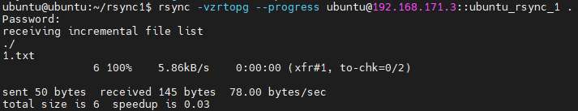

# rsync 文件同步服务

日常运维工作中，如果一个集群有很多台需要相同配置的节点，我们挨个去复制粘贴配置文件肯定是不行的。`rsync`工具能够简单的解决这个问题。

`rsync`是一个Linux下的增量同步工具，能够直接在任意两台网络连通的节点互相同步文件，也可以服务模式启动，同时处理多个客户端的同步内容，我们这里主要介绍后者。

## 启动rsync服务

`rsync`以守护进程模式运行服务，默认使用`837`端口。默认情况下，Ubuntu内置了`rsync`服务，但是没有启动。

启动`rsync`服务：

```
systemctl start rsync
```

默认开机启用`rsync`服务：

```
systemctl enable rsync
```

此外，还需要在配置文件`/etc/default/rsync`中，修改`RSYNC_ENABLE`为`true`。

## rsync配置

`rsync`的一个缺点是报错很不明确，配置项有误时报错经常不明所以，好在配置内容是比较简单的。

我们这里从安装目录的文档中复制一个配置文件到`/etc`下：

```
cp /usr/share/doc/rsync/examples/rsyncd.conf /etc
```

配置内容都很容易理解，我们这里使用的配置如下：

```
[ubuntu_rsync_1]
        comment = public archive
        path = /home/ubuntu/rsync1
        use chroot = no
#       max connections=10
        lock file = /var/lock/rsyncd
# the default for read only is yes...
        read only = false
        list = yes
        uid = ubuntu
        gid = ubuntu
#       exclude =
#       exclude from =
#       include =
#       include from =
        auth users = root
        secrets file = /etc/rsyncd.secrets
        strict modes = yes
#       hosts allow =
#       hosts deny =
        ignore errors = no
        ignore nonreadable = yes
        transfer logging = no
#       log format = %t: host %h (%a) %o %f (%l bytes). Total %b bytes.
        timeout = 600
        refuse options = checksum dry-run
        dont compress = *.gz *.tgz *.zip *.z *.rpm *.deb *.iso *.bz2 *.tbz
```

密码文件`rsyncd.secrets`需要设置权限为`600`：

```
chmod 600 /etc/rsyncd.secrets
```

此外，一定注意以下配置项：

* `ubuntu_rsync_1`这个配置块的名字是可以自己随意命名的，另一节点同步文件时需要指定该名字
* `path`配置了同步的文件目录
* `read only`配置是否只读，只读则只能从服务器拉取内容，而不能向服务器提交内容
* `uid`和`gid`是读写时的用户和用户组，这里我们使用的是用户Home目录，我们测试使用的用户和用户组名字都是`ubuntu`
* `auth users`配置了客户端同步时需要输入的用户名
* `secrets file`配置同步时需要输入的密码文件，文价格式例如`root:123`

提醒：密码文件的权限必须为`600`，否则`rsync`服务无法正确工作。

## 客户端执行同步

客户端一般不需要什么特殊配置，执行如下命令即可拉取服务端内容，按要求输入密码即可：

```
rsync -vzrtopg --progress root@192.168.171.3::ubuntu_rsync_1 .
```



`vzrtopg`是一些固定的选项，虽然看起来比较奇怪，但一般都是这样合到一起用的，具体参考`man page`文档。`progress`用于展示进度条，一般也是固定加上的。

后面内容格式为`[rsync用户名]@[服务器IP]::[配置块名字]`，注意配置块名字需要和服务器配置文件中指定的名字对应。

最后还有一个`.`，指定同步到当前目录。

提交内容时，将本地目录`.`和远程目录`root@192.168.171.3::ubuntu_rsync_1`互换一下位置就行了。

## Windows客户端

Windows下可以使用`cwRsync`作为客户端，基于`cygwin`实现，还是挺方便的。此外，Windows10的`WSL`功能应该也能实现。对于经常需要同步操作的目录，我们写两个批处理脚本，一个拉取，一个提交，使用时点一下就行了。

至于GUI客户端比较少，有个~~Grsync~~试用了一下难用到爆（强烈不推荐），`rsync`命令行工具的参数也不是很复杂，我们可以自己基于`cwRsync`编写一个。

`rsync`的另一个主要用途就是同步一些不太适合Git管理的文档，比如：不需要版本控制的日记、都是二进制文件的画册等。在VSCode中，我们可以搜索`Sync-Rsync`这个插件，用来同步一些文档之类的内容，也是非常方便。该插件也需要调用`rsync`命令，这里就不多做介绍了。

## 关于冲突处理

要注意的是，`rsync`仅仅是一个简单的文件同步工具，并没有任何的冲突处理机制（即节点A和B修改了同一个文件，然后互相同步，那么后拉取内容的客户端，修改将被覆盖而丢失），也就是说，这种同步是单向覆盖的。

实际上，这种分布式同步系统设计起来有很多问题需要考虑，也不存在一个完美的解决方案，像`rsync`这种最简易的办法其实应用的却是非常广泛，总之，适合使用场景的方案就是最好的。
