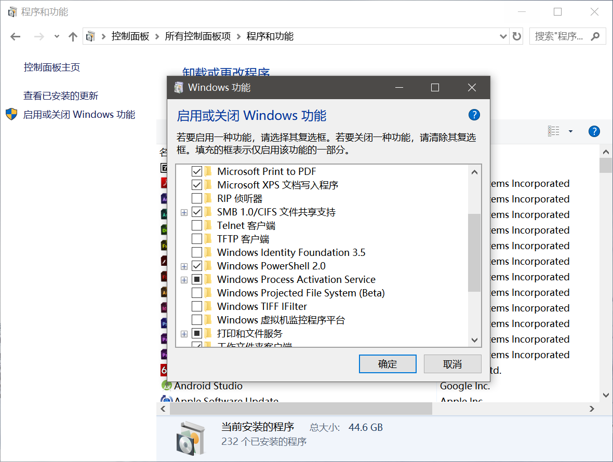
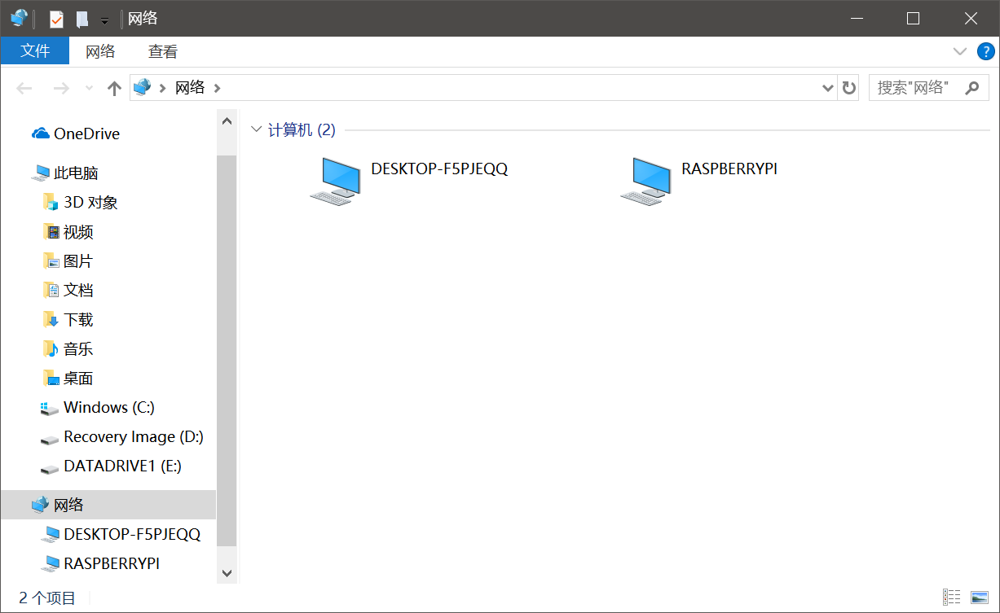
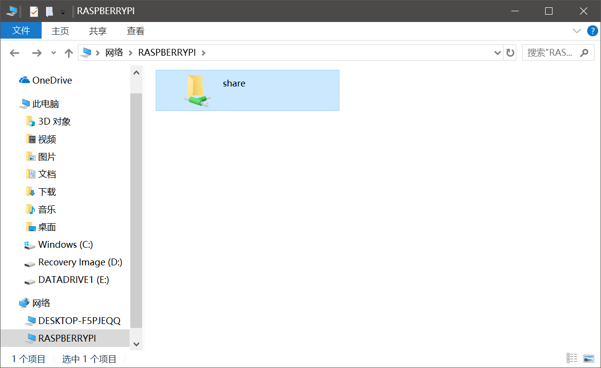

# samba 文件共享

samba可以说是使用体验最好的文件共享协议，秒杀各种网盘。samba设计的比较复杂，因此功能也比较强大，我们使用samba查看服务器上的文件时，就像在本地硬盘一样。除此之外，samba甚至还能共享打印机，但是其实不少打印机装Linux驱动都比较麻烦，我还没有试过。

我们搭建内网文件共享服务时应该优先考虑samba。本篇笔记记录samba的简单配置。

## Ubuntu下安装samba

```
sudo apt-get install samba
```

安装完成后，samba的主配置文件在`/etc/samba/smb.conf`。

## 配置一个共享目录

我们在配置文件最后新加一个`[share]`配置。

```
[share]
comment = Raspberry SMB Storage
path = /mnt/hdd/smb
read only = no
public = no
browseable = yes
valid users = pi
available = yes
```

这里`path`指向共享的目录，其它几个配置都比较好理解。注：`pi`是树莓派的默认用户名，我这里使用的是树莓派和Raspbian搭建的家庭文件共享服务，在Linux服务器上你要换成自己的用户名。

修改完配置文件后，重启samba服务即可，samba服务的名字叫`smbd`，我们可以用`systemctl restart smbd`进行重启。

## 在Windows上访问samba服务

这里以Windows10为例进行配置。在控制面板中，找到`程序和功能->启用或关闭Windows功能`，勾选`SMB 1.0/CIFS 文件共享支持`。



功能启用后，其它可被发现的计算机会出现在`网络`中。



我们可以用Linux上指定的用户名和密码登录samba服务。


