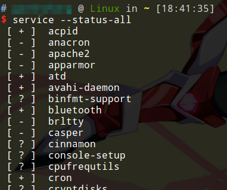

# service命令 管理服务

service命令是一个用于管理服务的命令行工具。

我们知道，各种服务程序在`/etc/init.d/`下有管理脚本，service命令其实也是一个脚本，帮助我们调用各种服务的管理脚本。我们不需要手动调用某个服务的管理脚本，直接使用service命令就行了。

注：在新的Linux发行版中，service命令已经过时了。

## 查看所有服务状态

```
service --status-all
```



其中，`+`表示正在运行，`-`表示未运行，`?`表示未知。其实这个命令显示的结果可能不太对，因为这是service遍历调用所有服务管理脚本查看服务状态来实现的。可能service脚本无法识别服务管理脚本返回的信息。我们可能要通过service命令，专门查看某一个服务的运行状态（通过直接调用服务管理脚本实现）。

## 控制服务程序

```
service SCRIPT COMMAND [OPTIONS]
```

举个例子：`service mysql start`，实际上service命令就是帮我们调用`/etc/init.d/mysql`脚本，传递`start`参数。当然，控制服务一般需要管理员权限，通常应该加上`sudo`。

## 例子 管理mysql服务

我们以mysql服务为例，看看如何使用service命令对其进行管理。

### 启动mysql服务

```
service mysql start
```

### 停止mysql服务

```
service mysql stop
```

### 重启mysql服务

```
service mysql restart
```

### 查看mysql服务状态

```
service mysql status
```

## 新的systemd工具

CentOS7和Ubuntu16.04等新的发行版，都已经改用systemd工具，来取代老的sysV init和service命令。有关systemd的内容，将在其他笔记中介绍。
