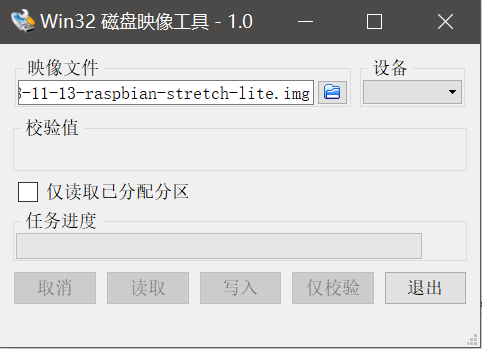
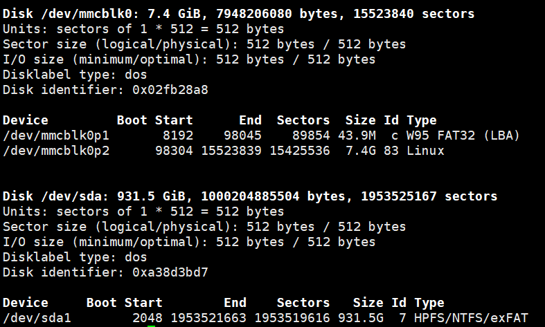
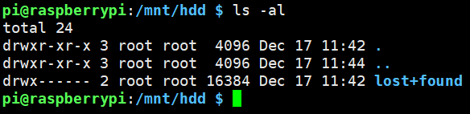

# 树莓派简介及入门

树莓派是一个基于ARM处理器的卡片式微型电脑，包含了大部分的常用接口，以及可编程控制的GPIO接口，树莓派功耗很低，当然处理器性能也很差，RaspberryPi3B+也只有1GB的DDR2内存。

## 组装硬件

要想正常开机，至少需要以下硬件：

* 树莓派卡片电脑的本体
* 一张MicroSD卡，以及读卡器
* 5V 2.5A的电源及USB充电线（老式的MicroUSB接口）

除此之外，可选的还有：

* 一根网线（如果不想用wifi）
* 外壳，没有外壳有弄脏主板甚至短路的可能，可以自制
* 散热器，别看树莓派性能不咋地，发热还是比较厉害的（比起手机），被动散热一般就足够了，风扇费电，而且需要注意外壳要有安装的地方

## 系统下载

Raspbian是基于Debian为树莓派定制的系统，使用起来和Debian基本无区别，这里我不需要桌面系统，因此选择下载
Raspbian Stretch Lite。

Raspbian系统：[https://www.raspberrypi.org/downloads/raspbian/](https://www.raspberrypi.org/downloads/raspbian/)

## 使用Win32DiskImage写入系统镜像到SD卡

首先插入SD卡，然后使用“Win32DiskImage”这个软件将下载的镜像写入卡中。



写入的镜像系统默认没有开启SSH功能，但我们需要用这个功能登入系统。在SD卡根目录中，创建一个空白的文件，名字就叫`ssh`，这样该功能就会自动开启了。

完成后，就可以将SD卡插进树莓派主板了，注意不要插反。

## 登入系统

连好网线和电源线，接通电源后树莓派就自动开机了。Windows下我们可以用Xshell登入，Linux下则可以直接使用ssh命令登录。

默认用户名密码：
```
用户名：pi
密码：raspberry
```

注：该用户属于`sudo`组

## 挂载硬盘

SD卡写入寿命比较低，如果需要大量文件存储，建议外接硬盘，外接硬盘可以用mount/umount命令挂载和卸载，但是树莓派主板上没有SATA接口，因此需要一个支持USB连接的硬盘盒。

连接硬盘后，我们可以看一下已经连接的设备：
```
fdisk -l
```

其中，`mmcblk`代表EMMC闪存设备，图中`sda`就是我们连接的硬盘了。



格式化硬盘为ext4文件系统：
```
sudo mkfs.ext4 /dev/sda1
```

挂载硬盘：
```
mkdir /mnt/hdd
mount /dev/sda1 /mnt/hdd
```



## 连接wifi

树莓派3B+自带了双频wifi模块，如果你不打算用网线，也可以连接无线局域网使用。

在电脑上插入树莓派的SD卡，在`boot`中创建一个`wpa_supplicant.conf`文件，写入网络SSID、连接密码等信息：

wpa_supplicant.conf
```
country=CN
ctrl_interface=DIR=/var/run/wpa_supplicant GROUP=netdev
update_config=1
network={
	ssid="mywifi"
	key_mgmt=WPA-PSK
	psk="mypassword"
	priority=1
	scan_ssid=1
}
```

注：

* 连接隐藏SSID的网络时，需要指定`scan_ssid=1`
* `priority`是连接的优先级，这个配置文件中可以配置多个网络，优先级配置较高的网络优先连接
* 我的无线网络是使用`WPA2-PSK AES`模式，如果使用其它安全配置，可能配置内容稍有区别
* 上面密码仅供参考

## 安装vim

Raspbian自带的vi命令指向一个老版本的vim编辑器，但是这个自带的vim实在是太坑了，用起来很让人崩溃，这里我们直接装一个新版本即可：

```
apt-get install vim
```

至此，我们的树莓派就基本可用了。
