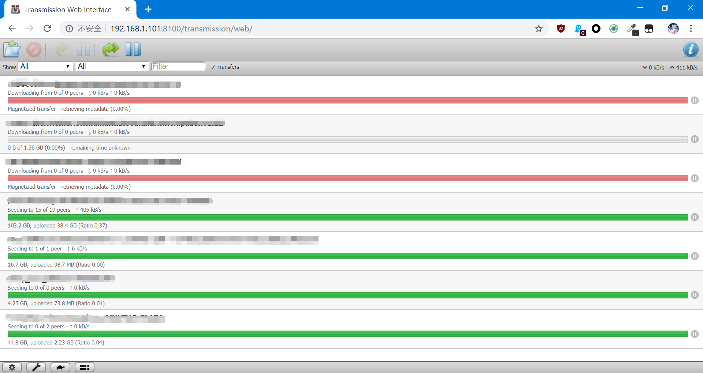
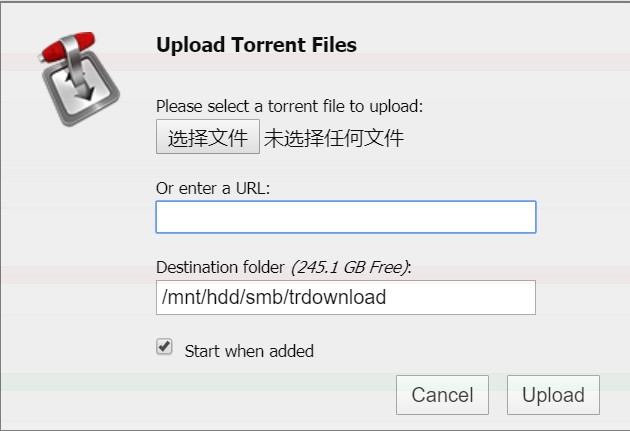

# 基于Transmission搭建下载机

在树莓派上，我们可以使用Transmission这个P2P下载软件，下载BT种子和磁力链。Transmission有GUI客户端和命令行工具，但我们这里使用的是一个叫做`transmission-daemon`的软件包，它能在我们的服务器上启动一个守护进程，我们可以通过浏览器访问管理页面，执行下载任务管理的操作，非常简单实用。

注：树莓派做下载机，优点是功耗低，缺点是树莓派的CPU性能差以及用USB挂载硬盘IO性能差。我使用的是30Mbps光纤，因此树莓派的性能还算够用。

## 安装`transmission-daemon`

```
sudo apt-get update
sudo apt-get install transmisson-daemon
```

## 启停服务

```
sudo systemctl start transmission-daemon
sudo systemctl stop transmission-daemon
```

## 配置文件

该软件的配置文件位于`/etc/transmission-daemon/settings.json`，其中一些选项我们需要手动配置。修改配置文件前，请先关闭服务，否则保存的修改会被自动丢弃。

这里介绍几个重要的配置项：

* `download-dir`：下载位置，我们可以将其指定到挂载的硬盘中
* `rpc-port`：管理界面的端口
* `rpc-user`：管理界面的登录用户名
* `rpc-password`：Web管理界面的密码，输入明文，服务启动后自动改为Hash值
* `rpc-url`：这个配置建议不要改，我改了之后无论如何都报405错误

## 访问Web管理界面

假如我们服务器的IP是`192.168.1.101`，Transmission的管理界面端口是`8100`，那么我们需要在浏览器中访问`http://192.168.1.101:8100/transmission/web/`，注意URL最后必须有个斜杠，否则报405错误（很奇葩）。根据提示输入用户名和密码，就可以开始使用了。



点击下面这个图标可以创建新的下载任务：


在弹出对话框中上传`.torrent`种子文件，或者直接输入磁力链，就可以下载了。


