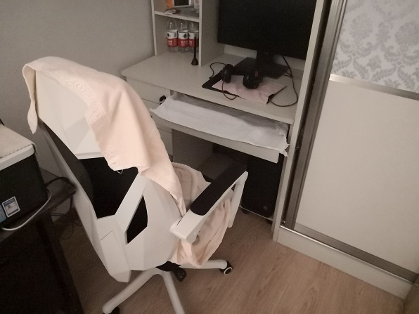

# 基于motion搭建监控系统

目前随着物联网的快速发展，搭建一个简单可用的监控系统系统很容易，像现在使用很广泛的360小水滴摄像头，硬件100元就可以买到，但这里介绍的是使用树莓派进行搭建。

## 摄像头的选用

似乎任何一个USB摄像头都能直接连接树莓派，不需要单独安装驱动，我使用的是一个很古老的台式机USB带话筒摄像头（由于树莓派没有3.5mm话筒插口，这里没有接话筒），购买时间大概是智能手机出现之前，然而买来居然从来没用过，吃灰至今，终于派上了用场。

## motion安装配置

启动摄像头，捕捉动态画面，这些工作有一个现成的软件可以实现，它就是`motion`，这篇笔记实际上就是记录一下`motion`如何使用。

我们要实现这样的目的：每天早晨`07:45`出发上班，定时启动监控，晚上`17:30`下班到家，定时关闭监控。监控过程中，所有的动态画面都会被记录下来，存放在硬盘中（当然实时同步到网络上就更好了）。

### 安装

```
sudo apt-get update

sudo apt-get install motion
```

### 配置

这里记录一些重要的配置项。

首先我们需要配置`motion`为守护进程模式：

/etc/default/motion
```
start_motion_daemon=yes
```

/etc/motion/motion.conf
```
daemon on
```

日志路径，由于日志不是太大，这里我就留作默认值：

```
logfile /var/log/motion/motion.log
```

调整记录的画面大小、旋转，这里不进行旋转，采集画面大小为640x480：

```
rotate 0
width 640
height 480
```

调整最大帧数，这里设置每秒2帧，对于监控这个需求基本够用了：

```
framerate 2
```

下面这个是用来截图的，默认情况下，`motion`会同时录像（生成视频）和截图（生成图片），这里我们一般不需要截图功能，设为`off`即可。

```
output_pictures off
```

录像功能打开，选择使用mpeg4编码：

```
ffmpeg_output_movies on
ffmpeg_video_codec mpeg4
```

设置保存路径，默认存储在`/var/lib/motion`下，但树莓派的系统盘使用的是闪存卡，容量和寿命都不太适合做监控，这里我保存在了外挂的移动硬盘上：

```
target_dir /mnt/hdd/motion
```

注意：树莓派加挂移动硬盘必须使用可单独供电的USB集线器，树莓派的USB供电带移动硬盘不够稳定，经常出现硬盘突然变成只读的情况，树莓派上的进程也经常出现问题。

`motion`自带一个简单的“直播”功能（其实是一张不断刷新的图片），可以通过浏览器访问，另外还带有一个web界面的控制台，这两个功能的端口通过`stream_port`和`webcontrol_port`指定，如果不需要，可以设置为`0`，我这里不需要因此将它们关闭了。

```
stream_port 0
webcontrol_port 0
```

### motion进程的启停

启动：
```
sudo motion
```

停止：
```
sudo pkill motion
```

注：我真没找到什么“优雅”的办法停止`motion`进程，只能`kill`掉。

### 配置crontab自动启停

```
sudo crontab -e
```

编辑内容如下：

```
45 7 * * 1-5 /usr/bin/motion
30 17 * * 1-5 pkill motion
```

这样我们就在计划任务中配置好`motion`的启停了。

## 藏好摄像头

如果你想神不知鬼不觉的监控别人，可以把摄像头藏在一个一般人想不到的位置，比如：


