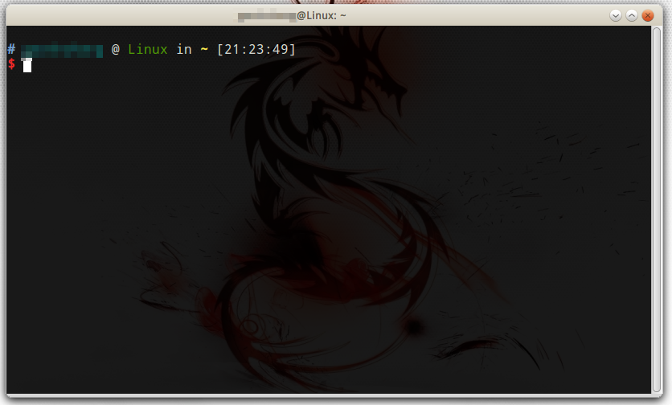
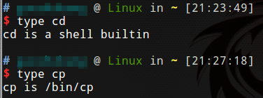
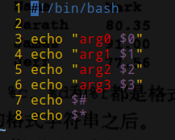
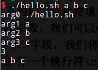

# shell和终端

shell是一个相对于内核的概念，在Linux桌面系统中，打开终端，终端是一个软件，这个软件连接到shell，在远程使用putty等软件连接到Linux服务器，也是连接到shell的过程。

终端软件：



注：Linux默认使用bash shell，图中的是zshell。

## shell内置命令

cd是shell内置命令，也就是说cd命令是实现在bash shell中的，可以用type cd查看其命令类型，而在终端输入cp等命令，其实是调用一个叫做cp的可执行文件，cp其实像是一个软件安装在系统中。



# 变量

## 变量命名

shell编程中，使用类似xx=10定义变量，变量名不能以数字开头，等号两边不能有空格，如果变量名有空格，需要用双引号引起来。定义变量不加$，引用时加$，否则会被当成普通字符串。使用unset xx（不加$）取消变量。

注：例如xx= 定义了变量xx，但是xx是空值，区别于xx变量不存在。

## 本地变量和环境变量

* 本地变量：只在当前shell有效，例：xx=10定义的变量
* 环境变量：所有子shell有效

定义本地变量
```shell
xx=10
```

定义环境变量：
```shell
xx=10 #第一种方法
export xx
export yy=10 #第二种方法
```

常用系统环境变量：

* $PATH 可执行文件默认搜索路径
* $HOME 用户家目录
* $USER 用户名
* $LANG 当前语言

# shell脚本文件

以.sh命名，里面包含shell脚本代码，第一行必须是`#!/bin/bash`，便于添加可执行权限后，指定使用bash shell解释器执行。

运行shell脚本的两种方式：

```shell
chmod +x hello.sh #第一种方法，添加可执行权限并运行
./hello.sh
sh hello.sh #第二种方法，直接调用shell解释器运行
```

# shell脚本接收参数

* `$1 $2...`表示第一个第二个参数。。。如果需要使用`$10`，会歧义解释为`$1和0`，所以应该写成`${10}`
* `$0`表示文件名
* `$#`表示参数个数
* `$*`表示所有参数

示例：




