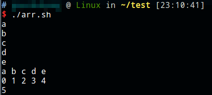
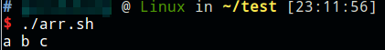

# 数组

* 定义数组：`xx=(aa bb cc dd)`
* `echo ${xx[0]}` 下标从0开始
* `echo ${xx[*]}`或`echo ${xx[@]}` 数组所有元素
* `echo ${!xx[*]}` 显示所有下标
* `echo ${#xx[*]}` 数组长度

示例代码：

```shell
#!/bin/bash

xx=(a b c d e)
echo ${xx[0]}
echo ${xx[1]}
echo ${xx[2]}
echo ${xx[3]}
echo ${xx[4]}
echo ${xx[*]}
echo ${!xx[*]}
echo ${#xx[*]}
```



数组也可以直接按下标指定：

```shell
#!/bin/bash

xx=()
xx[0]=a
xx[1]=b
xx[2]=c
echo ${xx[*]}
```


