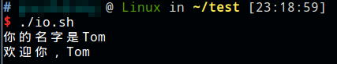
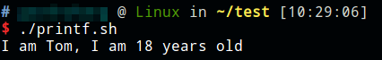
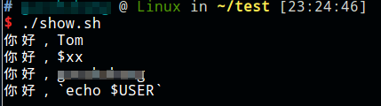
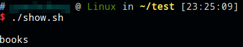

# read

read读入命令例子：`read xx`，输入值赋予xx变量。如果没有指定变量，默认赋值给 `$REPLY`

`-p`参数：添加提示符

# echo

输出变量例子：`echo $xx`

`-n`参数：输出不换行。默认是换行的

```shell
#!/bin/bash
read -p "你的名字是" name
echo "欢迎你，$name"
```



# printf

类似C语言的格式化输出。

```shell
#!/bin/bash

name="Tom"
age=18
printf "I am %s, I am %d years old\n" $name $age
```



# 变量的输出

* 双引号：双引号中的变量会被正常解析
* 单引号：单引号中的变量不会被解析
* 反引号：双引号包裹的内容中，如果有可执行命令，将其用反引号包裹就能执行，否则原样输出，单引号内无效

```shell
#!/bin/bash

xx="Tom"
echo "你好，$xx"
echo '你好，$xx'
echo "你好，`echo $USER`"
echo '你好，`echo $USER`'
```



# 避免输出歧义

建议使用大括号包裹变量名。

```shell
#!/bin/bash

xx="book"
echo "$xxs" #歧义，解析的是变量xxs
echo "${xx}s"
```


