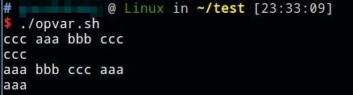

# 变量状态

变量有未定义，已定义但为空值，已定义不为空值三种状态。

# 截取操作

* `r=${var#*xxx}` 从前往后删，删到最近关键字
* `r=${var##*xxx}` 从前往后删，删到最远关键字
* `r=${var%xxx*}` 从后往前删，删到最近关键字
* `r=${var%%xxx*}` 从后往前删，删到最远关键字

```shell
#!/bin/bash

var="aaa bbb ccc aaa bbb ccc";
r=${var#*bbb}
echo $r
r=${var##*bbb}
echo $r
r=${var%bbb*}
echo $r
r=${var%%bbb*}
echo $r
```



# 赋值操作

`r=${xx-"aa"}`

如果xx存在，x赋值aa，否则r赋值aa

`r=${xx:-"aa"}`

如果xx不存在或是空值r赋值aa，否则r赋值xx

`r=${xx:="aa"}`

如果xx不存在r赋值aa，xx存在且为空xx和r都赋值aa，xx存在且不为空则r赋值xx

`r=${xx:?"aa"}`

xx未定义或为空，发出警告

`r=${xx:+"aa"}`

xx未定义或为空r不赋值x保持原样，xx存在且不为空则r赋值aa

# 别名

* 设置别名 alias
* 取消别名 unalias


如果命令和别名都存在，执行别名而不是命令本身。
