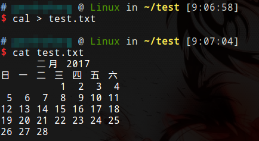
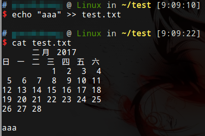
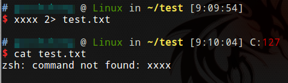
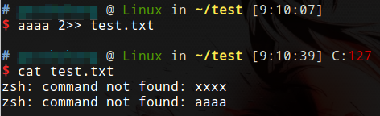
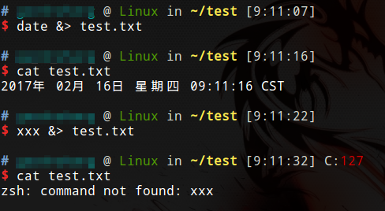
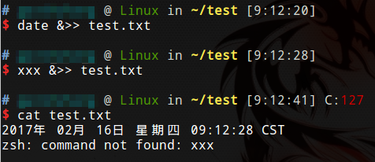
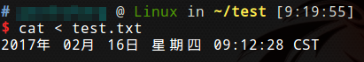
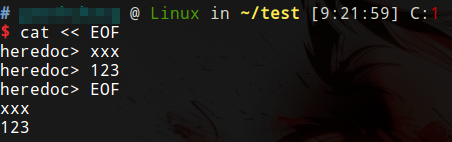
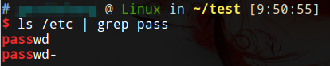

# 重定向和管道操作符

`>`

正确结果重定向。左侧是有效命令时，结果重定向到右侧。如果左侧不是有效命令，不会起作用。写入方式为覆盖。

`>>`

正确结果重定向。左侧是有效命令时，结果重定向到右侧。如果左侧不是有效命令，不会起作用。写入方式为追加。

`2>`

错误结果重定向。左侧不是有效命令时，结果重定向到右侧。如果左侧是有效命令，不会起作用。写入方式为覆盖。

`2>>`

错误结果重定向。左侧不是有效命令时，结果重定向到右侧。如果左侧是有效命令，不会起作用。写入方式为追加。

`&>`

无论左侧是否是有效命令都将结果写入右侧。写入方式为覆盖。

`&>>`

无论左侧是否是有效命令都将结果写入右侧。写入方式为追加。

`1>&2`

0表示标准输入，1表示标准输出，2表示标准错误输出。1>&2即标准输出重定向到标准错误输出。

`2>&1`

标准错误输出重定向到标准输出。

`<`

用于右侧内容重定向到左侧命令。

`<<`

用于heredoc。没什么用。

`|`

命令1 | 命令2 命令1执行结果是命令2的执行参数。

`&&`

命令1 && 命令2 第一个命令不成功，第二个就不会执行了。

`||`

命令1 || 命令2 两条命令都会执行。
