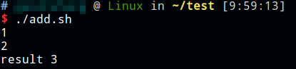
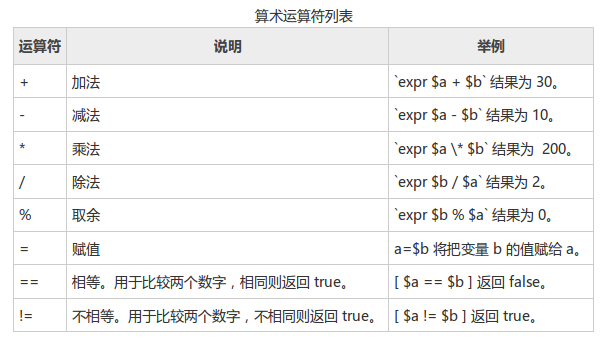
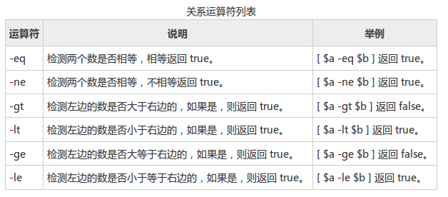
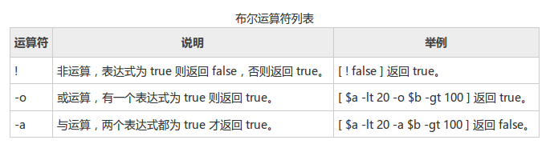
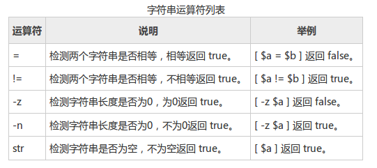

# 数学运算

原生bash不支持数学运算，因此可以通过expr命令实现。

```shell
#!/bin/bash

read x
read y
echo "result `expr $x + $y`"
```



注：使用乘号需要转义，即`\*`



注意：条件表达式要放在方括号之间，并且要有空格，例如 `[$a==$b]` 是错误的，必须写成 `[ $a == $b ]`。

# 关系运算符

关系运算符只支持数字，不支持字符串。



```shell
#!/bin/bash

a=10
b=10
if [ $a -eq $b ]
then
	echo "true"
else
	echo "false"
fi
```

注意：注意空格，then必须另起一行

# 布尔运算符



# 字符串运算符



# 文件测试运算符


