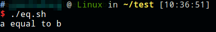

# if...fi语法

```shell
if [ expression ]
then
 Statement(s) to be executed if expression is true
fi​​
```

注：expression左右有空格，最后必须以fi结尾。

# if...else...fi语法

```shell
if [ expression ]
then
   Statement(s) to be executed if expression is true
else
   Statement(s) to be executed if expression is not true
fi
```

# if...elif...fi语法

```shell
if [ expression 1 ]
then
   Statement(s) to be executed if expression 1 is true
elif [ expression 2 ]
then
   Statement(s) to be executed if expression 2 is true
elif [ expression 3 ]
then
   Statement(s) to be executed if expression 3 is true
else
   Statement(s) to be executed if no expression is true
fi
```

```shell
#!/bin/bash

a=10
b=10
if [ $a -lt $b ]
then
	echo "a lesser than b"
elif [ $a -eq $b ]
then
	echo "a equal to b"
else
	echo "a greater to b"
fi
```


