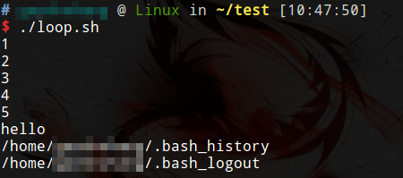
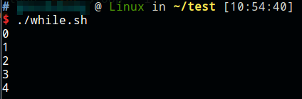
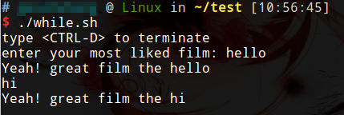

# for循环

```shell
for 变量 in 列表
do
    command1
    command2
    ...
    commandN
done
```

列表是一组值（数字、字符串等）组成的序列，每个值通过空格分隔。每循环一次，就将列表中的下一个值赋给变量。

应用举例：

```shell
#!/bin/bash

#遍历列表
for loop1 in 1 2 3 4 5
do
	echo $loop1
done

#遍历字符串
for loop2 in "hello"
do
	echo $loop2
done

#遍历字符串
for loop3 in $HOME/.bash*
do
	echo $loop3
done
```



# while循环

```shell
while command
do
   Statement(s) to be executed if command is true
done
```

循环示例代码

```shell
#!/bin/bash

loop=0
while [ $loop -lt 5 ]
do
	echo $loop
	loop=`expr $loop + 1`
done
```



循环读取键盘输入

```shell
#!/bin/bash

echo 'type <CTRL-D> to terminate'
echo -n 'enter your most liked film: '
while read FILM
do
    echo "Yeah! great film the $FILM"
done
```



跳出循环

* `break` 跳出当前循环
* `break n` 跳出n层循环
* `continue` 跳出一次循环，继续下一次循环
