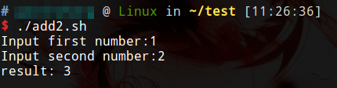

# 函数的格式

```shell
function function_name () {
    list of commands
    [ return value ]
}
```

函数返回值，可以显式增加return语句；如果不加，会将最后一条命令运行结果作为返回值。Shell 函数返回值只能是整数，一般用来表示函数执行成功与否，0表示成功，其他值表示失败。如果 return 其他数据，比如一个字符串，往往会得到错误提示：“numeric argument required”。如果一定要让函数返回字符串，那么可以先定义一个变量，用来接收函数的计算结果，脚本在需要的时候访问这个变量来获得函数返回值。函数返回值在调用该函数后通过 `$?` 来获得。

像删除变量一样，删除函数也可以使用 unset 命令，不过要加上 .f 选项。

函数定义没有顺序关系，前面调用后面定义的函数也是可以的。

调用函数例子

```shell
#!/bin/bash

function show1() {
	echo "this is function 1"
	return 100
}

function show2() {
	show1
	echo "show1 returns $?"
	echo "this is function 2"
}

show2
```

# 函数参数

参数传递使用$1 $2...

参数传递例子

```shell
#!/bin/bash
function add() {
	x=$1
	y=$2
	return `expr $x + $y`
}

read -p "Input first number:" x
read -p "Input second number:" y
add $x $y
echo "result: $?"
```


