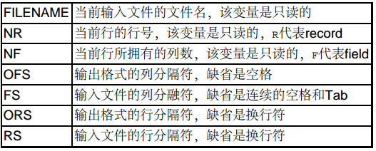

# awk

awk是Linux/Unix下强大的文本处理工具。awk经过改进，现在最常用的是gawk。sed以行为单位处理文件， awk比sed强的地方在于不仅能以行为单位还能以列为单位处理文件。 awk缺省的行分隔符是换行，缺省的列分隔符是连续的空格和Tab，但是行分隔符和列分隔符都可以自定义，比如/etc/passwd文件的每一行有若干个字段，字段之间以:分隔，就可以重新定义awk的列分隔符为:并以列为单位处理这个文件。 awk实际上是一门很复杂的脚本语言，还有像C语言一样的分支和循环结构，但是基本用法和sed类似， awk命令行的基本形式为：

```shell
awk option 'script' file1 file2 ...
awk option -f scriptfile file1 file2 ...
```

注意：必须是单引号

和sed一样， awk处理的文件既可以由标准输入重定向得到，也可以当命令行参数传入，编辑命令可以直接当命令行参数传入，也可以用-f参数指定一个脚本文件，编辑命令的格式为：

```shell
/pattern/{actions}
condition{actions}
```

* 和sed类似， pattern是正则表达式， actions是一系列操作。
* awk程序一行一行读出待处理文件，如果某一行与pattern匹配，或者满足condition条件，则执行相应的actions，如果一条awk命令只有actions部分，则actions作用于待处理文件的每一行。

自动变量$1、 $2分别表示第一列、第二列等，类似于Shell脚本的位置参数，而$0表示整个当前行。

```shell
awk '{print $2;}' testfile
```

awk也有和C语言非常相似的printf函数。

```shell
awk '$2<75 {printf "%s\t%s\n", $0, "REORDER";} $2>=75 {print $0;}' testfile
```

awk命令的condition部分还可以是两个特殊的condition－BEGIN和END，对于每个待处理文件， BEGIN后面的actions在处理整个文件之前执行一次， END后面的actions在整个文件处理完之后执行一次。

awk命令可以像C语言一样使用变量（但不需要定义变量），比如统计一个文件中的空行数：

```shell
 awk '/^ *$/ {x=x+1;} END {print x;}' testfile
 ```

## 常用内建变量



实例 打印系统中的用户帐号列表：

```shell
awk 'BEGIN {FS=":"} {print $1;}' /etc/passwd
```
