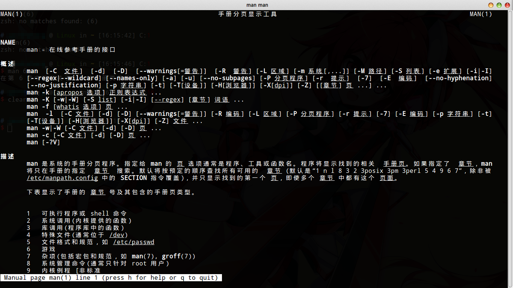

# man 手册页

可以说，Linux中最重要的命令就是这个`man`命令，`man`可以查询其他命令的帮助手册。

实际使用Linux的时候，我们不可能把所有命令全部记住，更不必说各种命令还有大量的参数了，虽然我们通过记笔记可以记一些常用的命令，但难免偶尔会碰到偏难怪的需求。在我们打开浏览器google之前，我建议前看一眼man手册。

# 如何使用 man

```
man man
```

该命令可以查看man自己的帮助手册。



我们看到`man`自己就有大量的命令行参数，这真是太复杂了。实际上这一大堆参数都很少用到。这里我们不准备一一介绍，碰到时现查即可。我们只关注下面两个用法。

## 查询命令的帮助

```
man <command>
```

例如`man ls`，就是查看`ls`命令的帮助。碰到没见过的命令，碰到忘了怎么用的命令，先`man`一下。

## 查询系统库函数的帮助

```
man 3 <function_name>
```

注意这个`3`。实际上`man`手册是分章节的，命令在第一章节，所以`man ls`1其实是显示的`man 1 ls`。但是`ls`显然是个命令而不是库函数或者系统调用之类的，所以`man`程序会自动把第一章节的内容呈现给我们。但是搜索非命令的内容，虽然`man`还是能够自动搜索，但我建议加上章节号，例如`man 3 strstr`查找`strstr()`函数的手册。

* 1 可执行程序（命令）或shell内置命令
* 2 系统调用
* 3 库函数
* 4 设备文件，通常位于`/dev`，例如`man 4 ram`
* 5 文件格式和规范，例如`man 5 passwd`
* 6 游戏（这什么鬼）
* 7 杂项（包括宏和规范）
* 8 系统管理命令（通常只针对root用户）
* 9 内核例程
