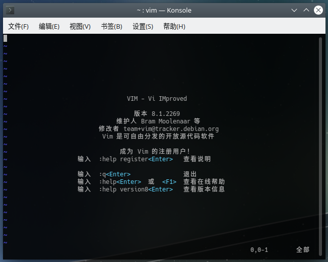

# vim 文本编辑器


Vim是一个基于字符终端的文本编辑器，功能强大，简单易学。因为Vim能够直接在字符终端上使用，对于开发人员来说，很多程序运行的目标平台都没有图形界面，因此Vim基本也是必须了解的内容。

[https://www.vim.org/](https://www.vim.org/)

## Vim安装

对于Linux的大多数发行版来说，字符终端版的Vim基本都是默认安装的，因此无需特别操作。只需在终端或终端模拟器里输入命令`vim`即可打开。



对于Windows来说，大多数情况都是使用ssh配合MobaXterm/XShell之类的工具，连接到目标平台上。当然，本地也可以使用`cygwin`或`WSL`的方式来使用Vim，这里就不多介绍了。

## 适用场景

### 适用

Vim最大的用途就是ssh连到没有图形界面的平台上，做些简单的开发或是修改配置文件，这个大家都比较了解。

除此之外，Vim还非常适合做代码文本的快速修改，尤其是批量SQL、CSV这类有一定结构化的文本，使用VSCode之类编辑器经常改的不胜其烦，使用Vim甚至能通过宏和精巧的操作命令，一下子就把任务完成。

对于软件开发来说，Vim比较适合汇编、C这类语法简单的语言，适合开发一些逻辑重于技术细节的底层模块、算法模块等，使用Vim能体会到输入速度追得上思路的感觉。

### 不适用

然而开发JavaEE之类的就不要尝试了，Eclipse等IDE的补全、分析、调试功能都是非常猛的，最主要的问题是这类偏应用层的开发经常是从文档、Github、老工程、某个神秘的压缩包、其它各种奇奇怪怪的地方复制粘贴代码，鼠标是避免不了的，鼠标和Vim操作之间来回切换，反而浪费了时间。

像JavaScript、Python这种动态语言，IDE的优势确实不明显。底层模块的开发倒还好，应用层的开发就十分不建议了，否则也是得不停搜索问题，复制粘贴代码，用Vim就会很累。

用Vim写小说、记笔记也不合适，操作折行文本和中文输入法处理起来比较烦，虽然也能解决，但归根结底中文输入比起记事本也没有优势，我个人是使用Atom/VSCode+Markdown+Git/rsync写中文内容，个人认为是比较好的解决方案。而且学习笔记经常也要从浏览器等地方复制东西，还得动用鼠标截个图什么的，用Vim不方便。

## Vim入门

如果想了解Vim的基本操作，可以输入以下命令：

```
vimtutor
```

该命令会启动一个Vim自带的交互式教程（有中文版），跟着操作学习，大约需要1小时即可学会基本操作，如：复制粘贴、搜索、替换、跳转、保存、退出等。我们也可以将其复制出来，练习几次，基本一两天就能熟练上手。
