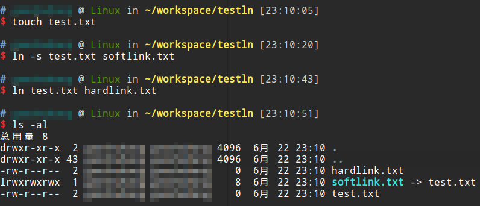

# ln命令 创建链接

硬链接和软链接是Linux文件系统中的重要概念，link（ln）命令是创建链接的工具。link功能比较简单，只能创建硬链接，我们建议使用ln命令，它功能较强，既能创建硬链接，又能创建软链接。我们可以在man手册中查到有关ln命令的详细说明：

```
man ln
```

## 硬链接和软链接

简要介绍一下Linux下的硬链接和软链接。

* 硬链接：多个硬链接有着相同的inode和文件数据块，就像是同一份文件数据，只是起了几个不同的别名作为其文件名。只有当一个文件的最后一个硬链接被删除时，该文件也就被标记为“删除”了。
* 软链接：软链接是一个单独的文件，它有自己的inode，只是其文件数据块比较特殊，它指向了另一个文件。软链接的概念更像是Windows中的快捷方式。

实际使用中，我们大部分时候用的都是软链接，比如在系统的可执行文件的搜索目录中防止软链接等。硬链接的用途之一是防止文件被误删。

## 创建软链接

```
ln -s <srcdir> <dstdir>
```

## 创建硬链接

```
ln <srcdir> <dstdir>
```

## 例子



这个例子中，我们分别对`test.txt`创建了一个硬链接和软链接，然后使用`ls -al`查看他们的区别。软链接会通过`->`显示出来，文件也有`l`属性。硬链接则看上去完全像是两个文件，实际上他们有相同的数据块。
