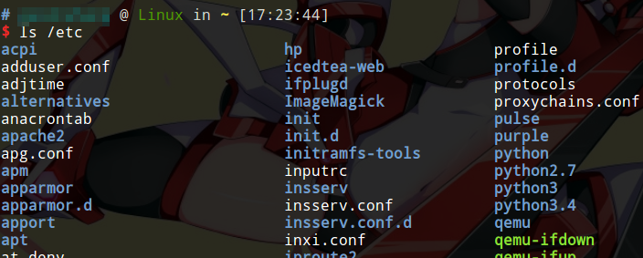
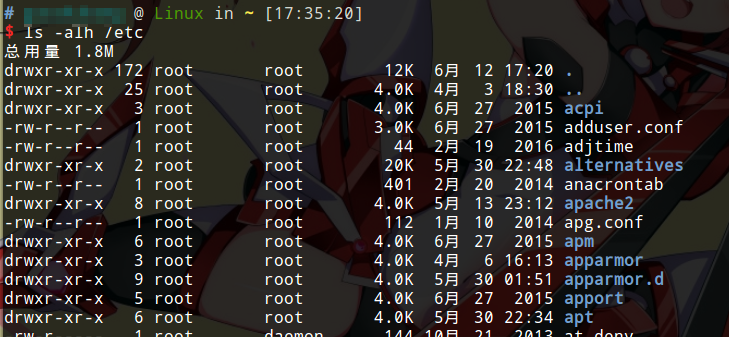
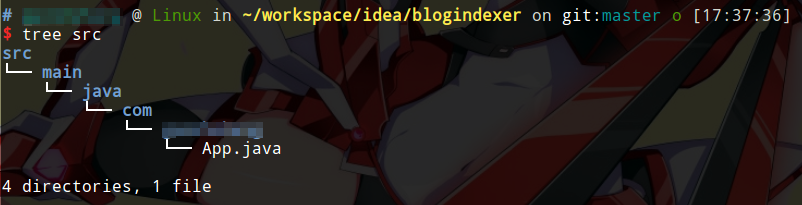

# 显示文件

ls是Linux最常用的命令，但是这个命令参数非常之多，我们可以使用`man ls`查看所有可用参数，实际上我们并不需要这么多参数。我们通过几个例子，记几个基本的参数就完全够用了。

## 最基本的显示文件

```
ls [dir]
```

此命令打印目录中所有文件（不包含以`.`开头的隐藏文件），只打印文件名。



## 显示文件详细信息

```
ls -alh [dir]
```

参数解释：

* `-a` 显示所有文件，包括隐藏文件和`.`、`..`
* `-l` 显示文件的详细信息
* `-h` 自动以`K`，`M`，`G`作为单位显示文件大小

此命令会详细显示文件的如下内容：

* 文件权限
* 该文件占用的i-node节点数（不知道把这项显示出来有什么意义，可能就是过度设计吧）
* 所属用户
* 所属用户组
* 文件大小
* 最后修改时间
* 文件名



除此之外，`ls -lh`有一个别名叫`ll`，也比较方便。

## 显示文件夹目录树

```
tree <dir>
```

tree程序通常没有预装，但是真的很好用，我们可以使用apt自行安装。

```
sudo apt-get intall tree
```

文件夹内的文件和子文件夹将以树形结构打印出来。


