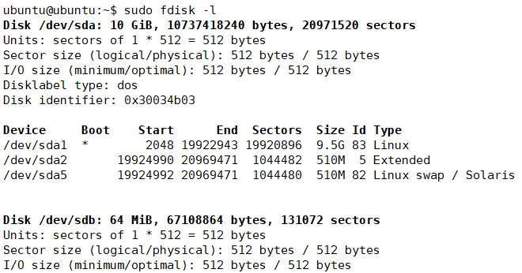

# 存储介质分区和格式化

Linux系统中，对硬盘分区、格式化等操作是十分简单的，只要借助于`fdisk`和`mkfs`两个命令即可，另外诸如对U盘格式化等也是类似的操作，这篇笔记我们简单介绍一下。

## 查看存储设备信息

```
fdisk -l
```

下面是一个例子：



上面图中，我们可以看到有两块硬盘，`/dev/sda`是已经安装好的，被划分为了若干分区。另一块硬盘是`/dev/sdb`，容量`64MB`，还未格式化和分区。

## 创建分区

这里我们以`/dev/sdb`为例创建分区：

```
fdisk /dev/sdb
```


`fdisk`的分区功能是一个交互式的命令行工具，我们可以根据提示，输入`m`，查看帮助信息。命令都非常简单，按`n`开始创建分区，然后按照提示操作即可，操作过程中可以按`p`查看已经创建的分区。

这里我的硬盘是64MB，因此创建了一个16MB的主分区，剩余空间作为扩展分区，创建了3个逻辑分区。


创建完成后，按`w`保存即可。

## 格式化

创建分区后，还需要进行格式化，`mkfs`系列命令可以进行格式化操作。

```
mkfs.ext4 /dev/sdb1
```

* `.ext4` 该命令可以接很多文件系统参数，这里我们一般都是使用`ext4`
* `/dev/sdb1` 要格式化的分区

依次将我们的主分区、逻辑分区格式化即可。

注：如果未进行分区，直接使用格式化命令`mkfs.ext4 /dev/sdb`，那么整个存储设备会作为一个分区存在。格式化U盘时，通常我们都是这样操作。

## 挂载和卸载分区

挂载分区可以使用`mount`命令，下面例子中，我们将`sdb1`分区挂载到`/mnt/sdb1`文件夹：

```
mount /dev/sdb1 /mnt/sdb1
```

这样，我们就可以正常访问`sdb1`分区了。

卸载分区使用`umount`命令，注意不是~~unmount~~。

```
umount /dev/sdb1
```
