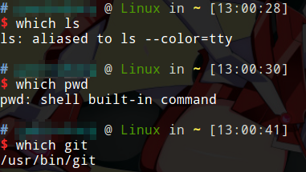
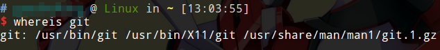
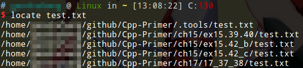
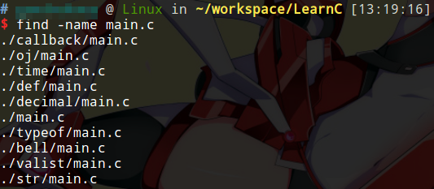

# 查找文件

Linux中有几个查找文件的命令，他们分别是`which`，`whereis`，`locate`，`find`，每个命令都有自己的使用场景。具体请参考man手册，下面我们一一介绍一些常见用法以备随时查阅。

## which

```
which <command>
```

`which`用于查找一个命令的可执行文件位置。使用例子如下：



我们可以观察到，如果某个命令是一个别名，或者是shell内置命令，`which`后都会有所显示。对于`git`这样的命令，则是直接显示出了它的可执行文件路径。

## whereis

```
where <command>
```

`whereis`也是用于查询一个命令，但是不仅会列出该命令的可执行文件位置，还会列出这个命令的源代码和man手册（前提是正确安装了这些附加选项）。例子：



## locate

```
locate <filename>
locate -r <pattern>
```

`locate`用于根据文件名查找一个文件，是最常用的文件查找命令，它不直接遍历磁盘，而是通过数据库索引了所有的文件名，使用该命令时查询的是数据库，因此即使我们的磁盘有几个TB，查询结果还是秒出。缺点是它查询的数据库和当前所有文件夹不是时时对应的，而是通过cron定期刷新这个数据库，对于刚刚创建的文件，`locate`是查不到的。



## find

```
find -name <filename>
```

`find`是递归遍历磁盘查找一个文件，遍历的起点就是当前目录。显然`find`命令对于大量文件会非常慢，因此通常适用于弥补`locate`的不足，在一个包含少量文件的文件夹内搜索文件。其次，`find`不仅可以根据文件名查找，还能选择其他条件，不过实际上并不常用，具体请参考man手册。


