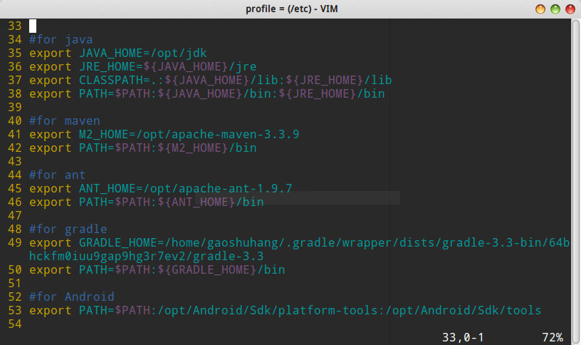

# export 设置环境变量

Linux中可以通过在`/etc/profile`中，使用`export`命令设置环境变量，因为这个脚本文件在每个用户登入时都会运行，用来设置全局环境变量。我们也可以单独使用`export`命令，来临时设置一个环境变量。

`/etc/profile`文件



## 使用export命令

```
export [变量名称]=[变量值]
```

打开终端，使用`export`命令设置的环境变量，只在当前shell内有效，因此这种方法设置的环境变量是临时的。

## 追加设置环境变量

比如`PATH`环境变量，用于指定系统搜索可执行文件的路径。这个路径有很多，Linux中以`:`作为分隔符进行分隔。

我的笔记本电脑的`PATH`
```
/opt/Qt5.7.0/5.7/gcc_64//bin:/usr/local/sbin:/usr/local/bin:/usr/sbin:/usr/bin:/sbin:/bin:/usr/games:/usr/local/games:/opt/jdk/bin:/opt/jdk/jre/bin:/opt/apache-maven-3.3.9/bin:/opt/apache-ant-1.9.7/bin:/home/ciyaz/.gradle/wrapper/dists/gradle-3.3-bin/64bhckfm0iuu9gap9hg3r7ev2/gradle-3.3/bin:/opt/Android/Sdk/platform-tools:/opt/Android/Sdk/tools:/opt/apache-jmeter-3.2/bin
```

追加设置例子如下：

```
export PATH=$PATH:/home/ciyaz
```

这里只是作为演示，将用户目录设置为环境变量，注意`$`，这个符号在shell中只在引用变量时使用。
