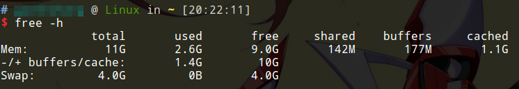

# free命令 查看内存使用

free命令可以查看Linux系统的内存占用情况。

```
free -h
```

* `-h`选项：自动以`K M G`作为单位，显示大小。

## 例子

下面图是使用free命令查看我的笔记本电脑上的内存占用情况：



* total：总内存
* used：已使用内存
* free：空闲内存
* shared：不同应用的相同数据
* buffers：用于缓冲磁盘块的内存大小
* cached：当前缓存的内存页
