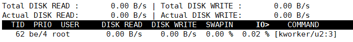

# iotop-查看进程磁盘占用率

Linux下，`iotop`工具可以查看进程的磁盘当前读写速度、占用率等性能指标，这个工具和`top`工具比较类似，但大多数系统并不自带，我们可以自行安装。

```
apt-get install iotop
```

## 常见用法

查看当前磁盘占用不为`0`的进程：

```
iotop -o
```

* `-o` 只列出磁盘占用不为`0`的进程

注意：`iotop`工具需要`root`权限，所以可能需要加上`sudo`。


