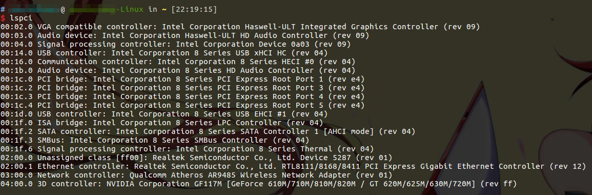

# lspci 显示总线信息

lspci命令用于显示当前电脑上，所有已连接的PCI设备信息。



上图是我的笔记本电脑中，显示的PCI总线信息。

除此之外，`-v`选项能够显示详细信息，但是输出结果比较多。

```
00:02.0 VGA compatible controller: Intel Corporation Haswell-ULT Integrated Graphics Controller (rev 09) (prog-if 00 [VGA controller])
	Subsystem: ASUSTeK Computer Inc. Haswell-ULT Integrated Graphics Controller
	Flags: bus master, fast devsel, latency 0, IRQ 48
	Memory at f7400000 (64-bit, non-prefetchable) [size=4M]
	Memory at d0000000 (64-bit, prefetchable) [size=256M]
	I/O ports at f000 [size=64]
	[virtual] Expansion ROM at 000c0000 [disabled] [size=128K]
	Capabilities: <access denied>
	Kernel driver in use: i915
	Kernel modules: i915

00:03.0 Audio device: Intel Corporation Haswell-ULT HD Audio Controller (rev 09)
	Subsystem: ASUSTeK Computer Inc. Haswell-ULT HD Audio Controller
	Flags: bus master, fast devsel, latency 0, IRQ 51
	Memory at f7a1c000 (64-bit, non-prefetchable) [size=16K]
	Capabilities: <access denied>
	Kernel driver in use: snd_hda_intel
	Kernel modules: snd_hda_intel

00:04.0 Signal processing controller: Intel Corporation Device 0a03 (rev 09)
	Subsystem: ASUSTeK Computer Inc. Device 131d
	Flags: bus master, fast devsel, latency 0, IRQ 16
	Memory at f7a10000 (64-bit, non-prefetchable) [size=32K]
	Capabilities: <access denied>
	Kernel driver in use: proc_thermal
	Kernel modules: processor_thermal_device

00:14.0 USB controller: Intel Corporation 8 Series USB xHCI HC (rev 04) (prog-if 30 [XHCI])
	Subsystem: ASUSTeK Computer Inc. 8 Series USB xHCI HC
	Flags: bus master, medium devsel, latency 0, IRQ 44
	Memory at f7a00000 (64-bit, non-prefetchable) [size=64K]
	Capabilities: <access denied>
	Kernel driver in use: xhci_hcd

00:16.0 Communication controller: Intel Corporation 8 Series HECI #0 (rev 04)
	Subsystem: ASUSTeK Computer Inc. 8 Series HECI
	Flags: bus master, fast devsel, latency 0, IRQ 49
	Memory at f7a25000 (64-bit, non-prefetchable) [size=32]
	Capabilities: <access denied>
	Kernel driver in use: mei_me
	Kernel modules: mei_me

00:1b.0 Audio device: Intel Corporation 8 Series HD Audio Controller (rev 04)
	Subsystem: ASUSTeK Computer Inc. 8 Series HD Audio Controller
	Flags: bus master, fast devsel, latency 0, IRQ 50
	Memory at f7a18000 (64-bit, non-prefetchable) [size=16K]
	Capabilities: <access denied>
	Kernel driver in use: snd_hda_intel
	Kernel modules: snd_hda_intel

00:1c.0 PCI bridge: Intel Corporation 8 Series PCI Express Root Port 1 (rev e4) (prog-if 00 [Normal decode])
	Flags: bus master, fast devsel, latency 0, IRQ 40
	Bus: primary=00, secondary=01, subordinate=01, sec-latency=0
	Capabilities: <access denied>
	Kernel driver in use: pcieport
	Kernel modules: shpchp

00:1c.2 PCI bridge: Intel Corporation 8 Series PCI Express Root Port 3 (rev e4) (prog-if 00 [Normal decode])
	Flags: bus master, fast devsel, latency 0, IRQ 41
	Bus: primary=00, secondary=02, subordinate=02, sec-latency=0
	I/O behind bridge: 0000e000-0000efff
	Memory behind bridge: f7900000-f79fffff
	Capabilities: <access denied>
	Kernel driver in use: pcieport
	Kernel modules: shpchp

00:1c.3 PCI bridge: Intel Corporation 8 Series PCI Express Root Port 4 (rev e4) (prog-if 00 [Normal decode])
	Flags: bus master, fast devsel, latency 0, IRQ 42
	Bus: primary=00, secondary=03, subordinate=03, sec-latency=0
	Memory behind bridge: f7800000-f78fffff
	Capabilities: <access denied>
	Kernel driver in use: pcieport
	Kernel modules: shpchp

00:1c.4 PCI bridge: Intel Corporation 8 Series PCI Express Root Port 5 (rev e4) (prog-if 00 [Normal decode])
	Flags: bus master, fast devsel, latency 0, IRQ 43
	Bus: primary=00, secondary=04, subordinate=04, sec-latency=0
	I/O behind bridge: 0000d000-0000dfff
	Memory behind bridge: f6000000-f70fffff
	Prefetchable memory behind bridge: 00000000e0000000-00000000f1ffffff
	Capabilities: <access denied>
	Kernel driver in use: pcieport
	Kernel modules: shpchp

00:1d.0 USB controller: Intel Corporation 8 Series USB EHCI #1 (rev 04) (prog-if 20 [EHCI])
	Subsystem: ASUSTeK Computer Inc. 8 Series USB EHCI
	Flags: bus master, medium devsel, latency 0, IRQ 23
	Memory at f7a23000 (32-bit, non-prefetchable) [size=1K]
	Capabilities: <access denied>
	Kernel driver in use: ehci-pci

00:1f.0 ISA bridge: Intel Corporation 8 Series LPC Controller (rev 04)
	Subsystem: ASUSTeK Computer Inc. 8 Series LPC Controller
	Flags: bus master, medium devsel, latency 0
	Capabilities: <access denied>
	Kernel driver in use: lpc_ich
	Kernel modules: lpc_ich

00:1f.2 SATA controller: Intel Corporation 8 Series SATA Controller 1 [AHCI mode] (rev 04) (prog-if 01 [AHCI 1.0])
	Subsystem: ASUSTeK Computer Inc. 8 Series SATA Controller 1 [AHCI mode]
	Flags: bus master, 66MHz, medium devsel, latency 0, IRQ 46
	I/O ports at f0b0 [size=8]
	I/O ports at f0a0 [size=4]
	I/O ports at f090 [size=8]
	I/O ports at f080 [size=4]
	I/O ports at f060 [size=32]
	Memory at f7a22000 (32-bit, non-prefetchable) [size=2K]
	Capabilities: <access denied>
	Kernel driver in use: ahci
	Kernel modules: ahci

00:1f.3 SMBus: Intel Corporation 8 Series SMBus Controller (rev 04)
	Subsystem: ASUSTeK Computer Inc. 8 Series SMBus Controller
	Flags: medium devsel, IRQ 3
	Memory at f7a21000 (64-bit, non-prefetchable) [size=256]
	I/O ports at f040 [size=32]
	Kernel modules: i2c_i801

00:1f.6 Signal processing controller: Intel Corporation 8 Series Thermal (rev 04)
	Subsystem: ASUSTeK Computer Inc. 8 Series Thermal
	Flags: bus master, fast devsel, latency 0, IRQ 18
	Memory at f7a20000 (64-bit, non-prefetchable) [size=4K]
	Capabilities: <access denied>
	Kernel driver in use: intel_pch_thermal
	Kernel modules: intel_pch_thermal

02:00.0 Unassigned class [ff00]: Realtek Semiconductor Co., Ltd. Device 5287 (rev 01)
	Subsystem: ASUSTeK Computer Inc. Device 202f
	Flags: bus master, fast devsel, latency 0, IRQ 45
	Memory at f7915000 (32-bit, non-prefetchable) [size=4K]
	Expansion ROM at f7900000 [disabled] [size=64K]
	Capabilities: <access denied>
	Kernel driver in use: rtsx_pci
	Kernel modules: rtsx_pci

02:00.1 Ethernet controller: Realtek Semiconductor Co., Ltd. RTL8111/8168/8411 PCI Express Gigabit Ethernet Controller (rev 12)
	Subsystem: ASUSTeK Computer Inc. RTL8111/8168/8411 PCI Express Gigabit Ethernet Controller
	Flags: bus master, fast devsel, latency 0, IRQ 47
	I/O ports at e000 [size=256]
	Memory at f7914000 (64-bit, non-prefetchable) [size=4K]
	Memory at f7910000 (64-bit, non-prefetchable) [size=16K]
	Capabilities: <access denied>
	Kernel driver in use: r8169
	Kernel modules: r8169

03:00.0 Network controller: Qualcomm Atheros AR9485 Wireless Network Adapter (rev 01)
	Subsystem: AzureWave AW-NE186H
	Flags: bus master, fast devsel, latency 0, IRQ 19
	Memory at f7800000 (64-bit, non-prefetchable) [size=512K]
	Expansion ROM at f7880000 [disabled] [size=64K]
	Capabilities: <access denied>
	Kernel driver in use: ath9k
	Kernel modules: ath9k

04:00.0 3D controller: NVIDIA Corporation GF117M [GeForce 610M/710M/810M/820M / GT 620M/625M/630M/720M] (rev ff) (prog-if ff)
	!!! Unknown header type 7f
	Kernel modules: nvidiafb, nouveau, nvidia_340
```
