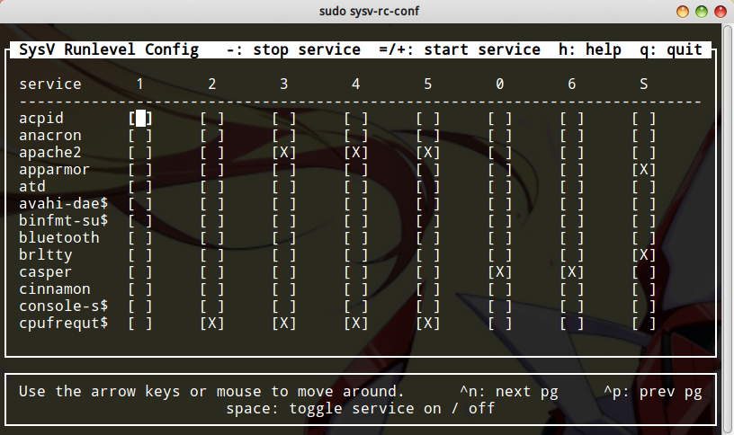

# sysv-rc-conf 启动级别配置

我们知道，服务程序有0-6，共7个启动级别（runlevel），这部分知识可以参考`Linux系统维护/Linux操作系统基础/Linux系统启动过程`。在Debian中，2-5级是完全一样的，也就是说，Debian中启动级别的2-5级要么都配置上，要么都不配。

在sysV风格的启动级别管理中，`/etc`下有若干个`rcX.d`，里面包含一些软链接，我们可以手动修改`rcX.d`里的软链接实现启动级别配置，但是这太麻烦，还容易出错，出错还难排查。因此我们可以使用`sysv-rc-conf`工具，这个工具实际上就是给我们显示一个界面，我们通过这个工具取操作`rcX.d`里面的软链接。

后期补充：现在大多数发行版都使用`systemd`来管理服务，`systemd`其实也是兼容`sysV`的，因此`sysv-rc-conf`某些特殊情况下可能还会用到，但实际上现在还是以`systemd`为主，不建议再混用旧的配置方式了。

## 安装sysv-rc-conf

通常情况下，系统没有自带这个工具，我们要安装一下：
```
sudo apt-get install sysv-rc-conf
```

## 使用sysv-rc-conf

```
sudo sysv-rc-conf
```



注意这个工具需要root权限。界面里写的比较清楚了，`space`键选择或取消选择，上下左右键移动光标，`q`键退出，退出前会提醒我们是否保存。

## 有的服务在sysv-rc-conf中找不到

有的软件不遵循sysV风格，没有在`rcX.d`中建立链接，但是在`/etc/init`下有init脚本，比如mongodb。这种时候，如果我们想取消mongodb的开机启动，`sysv-rc-conf`就派不上用场了，那就只能手动修改`/etc/init/mongod.conf`，这实际上是一个shell脚本。
