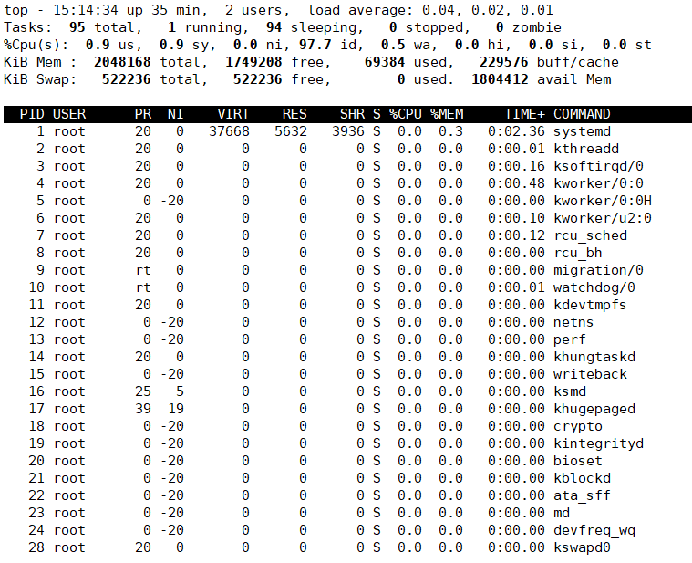
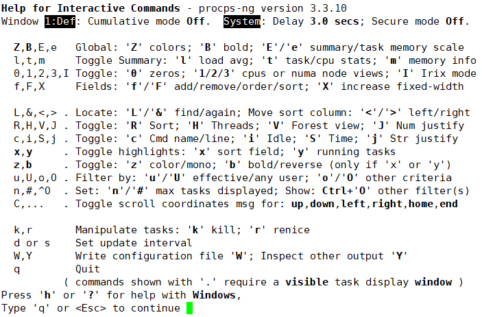

# top-查看系统资源占用率

Linux系统中，`top`工具像Windows的任务管理器一样，能够方便的查看系统中的各个进程，和它们占用的CPU、内存等情况。

## 进程列表

直接在终端中输入`top`，即可查看到当前系统中的前若干个进程。

```
top
```



* `PID` 进程号
* `USER` 进程所属的用户名
* `PR` 进程优先级
* `NI` 进程的`nice`值，参考`Linux操作系统使用及维护/进程与作业控制命令/nice-调整进程优先级`
* `VIRT` 进程申请的总内存
* `RES` 进程实际使用的物理内存
* `SHR` 进程的共享内存
* `S` 进程状态
  * `D` 不可中断的睡眠
  * `R` 运行
  * `S` 可中断的睡眠
  * `T` 暂停或跟踪状态
  * `Z` 僵尸进程
* `%CPU` CPU使用率
* `%MEM` 内存使用率
* `TIME+` 进程使用的总CPU时间

## 切换显示信息

我们经常需要查看「当前系统中，内存占用百分之多少」诸如此类的问题。上网搜索时，会告诉你各种按`m`、按`p`等方法，乍一看其实很复杂，很难用。

其实，`top`命令支持的各种操作，我们只要按下`h`，就可以查看帮助了。



例如内存，我们按下`m`键，就可以切换内存信息、内存百分比条等展示方式。

## 排序

进程列表可以排序显示：

* `Shift+N`：以PID排序
* `Shift+P`：以CPU使用率排序
* `Shift+M`：以内存使用率排序
