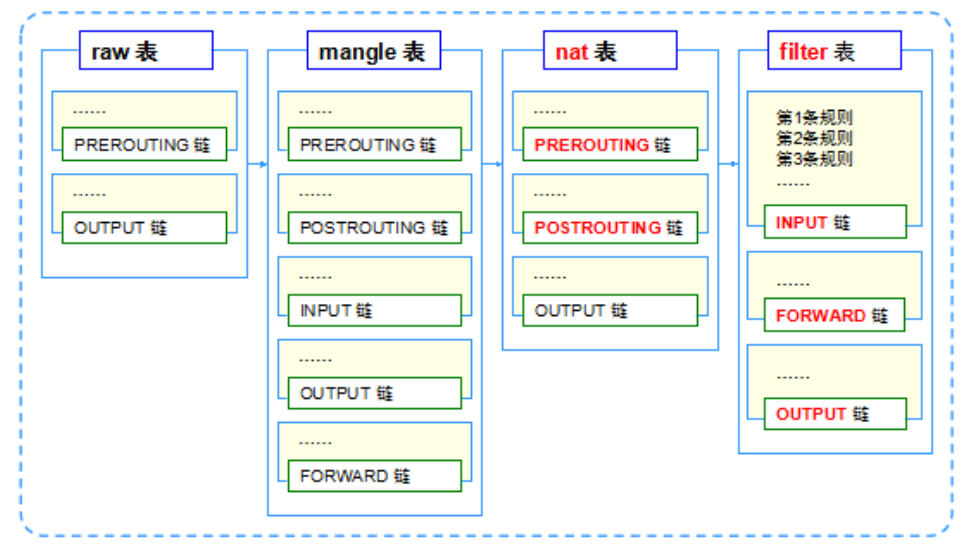

# iptables 配置防火墙

netfilter是Linux内核提供的一个子系统，提供了用于网络数据包过滤的函数库。Linux下的防火墙可以基于netfilter实现，iptables是一个Linux下的防火墙管理工具（底层还是netfilter），我们通过iptables可以很方便的对Linux防火墙进行配置。

## 规则连和规则表

在iptables中我们设置的数据包过滤策略叫做“规则”，多个规则可以形成一条“规则链”，对数据包依次过滤。定义一条规则需要指定匹配的数据包，以及如何处理。常见的处理方式有：

* ACCEPT 接受该数据包
* DROP 直接丢弃该数据包
* REJECT 拒绝该数据包，和DROP不同的是丢弃数据包后会向发送端报告该数据被丢弃，DROP直接丢弃没有任何回复
* LOG 记录日志，然后匹配规则连的下一条规则

“规则表”就是用来容纳规则链的，默认规则表有四个：

* raw 确定是否对该数据包进行状态跟踪
* mangle 为数据包设置标记
* nat 修改数据包中的源、目标IP地址和端口，用于网络地址转发
* filter 是否放行一个数据包

我们配置防火墙时一般都是使用filter表，配置命令不指定规则表，默认就是filter表。



规则表的执行顺序是raw->mangle->nat->filter，规则连的执行顺序是：

* 入站顺序 PREROUTING->INPUT
* 出站顺序 OUTPUT->POSTROUTING
* 转发顺序 PREROUTING->FORWARD->POSTROUTING

## iptables命令的配置选项

iptables的参数很多，具体可以查看man手册，这里就不一一介绍了，介绍几个常用的参数选项。

* -P 设置默认策略
* -F 清空规则链
* -L 查看规则链
* -A 在规则链末尾插入规则
* -I 序号 在规则链开头插入规则
* -D 序号 删除一条规则
* -s 匹配来源地址（IP/掩码）
* -d 匹配目标地址
* -i 网卡名 匹配从指定网卡流入的数据
* -o 网卡名 匹配从指定网卡流出的数据
* -p 匹配某种协议
* -j 指定该条规则的目的，比如：如果匹配，怎样处理某个数据包
* -dport 匹配目的端口号
* -sport 匹配源端口号

## 例子

注意：测试iptables时一定要谨慎，最好使用虚拟机，否则可能造成ssh无法登入Linux系统。

查看所有规则链包含的规则
```
iptables -L
```

将INPUT链的默认策略设置为拒绝
```
iptables -P INPUT DROP
```

在INPUT上允许ICMP协议（在INPUT默认规则为拒绝的前提下，也就是白名单模式）
```
iptables -I INPUT -p icmp -j ACCEPT
```

拒绝某一IP的报文
```
iptables -I INPUT -s 192.168.1.104 -j DROP
```

记录所有ssh连接本机通信的日志（ssh使用TCP协议22端口），查看日志可以使用`dmesg`命令
```
iptables -I INPUT -p tcp --dport 22 -j LOG
```

限制某一IP某段时间对本机的访问
```
iptables -I INPUT -s 192.168.1.104 -m time --timestart 06:00 --timestop 07:00 -j DROP
```

注意：这里配置时使用的是UTC时间，例如现在是下午2点，即14:00，对应UTC时间就是06:00，要减8。
