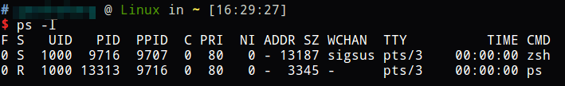

# nice调整Linux进程优先级

多个进程被CPU分片执行，影响系统性能的重要的进程应该分得更多的时间片，因此我们使用`nice`和`renice`命令为进程设置优先级。

我们可以使用`ps -l`观察一下我们当前bash相关的进程：



其中PRI和NI共同组成进程运行的优先级。这里要说明的是，`nice`命令并不直接修改优先级，优先级实际上等于`PRI`，`nice`修改的是`NI`，修改`NI`后，`新PRI=原PRI+NI`也就是说，我们使用`nice`指定负值的NI就可以提升进程优先级，相反就会降低进程优先级。

## nice命令的使用

```
nice -n <ni> <command>
```

* `-n`参数：指定优先级NI数值。取值范围-20到19，设置负数必须具有root权限。

例如：我们使用`nice -n -5 ./test`，会以默认优先级减5运行test程序。注：较小数值优先级优先程度较高，因此该优先级比默认高。

## renice命令的使用

`nice`命令会执行一个程序，`renice`则是调整一个正在执行的程序的优先级。

```
renice -n <ni> -p <pid>
```

`renice`和`nice`程序的作用相同，只不过`renice`需要直到进程的PID，修改正在运行的进程的优先级。
