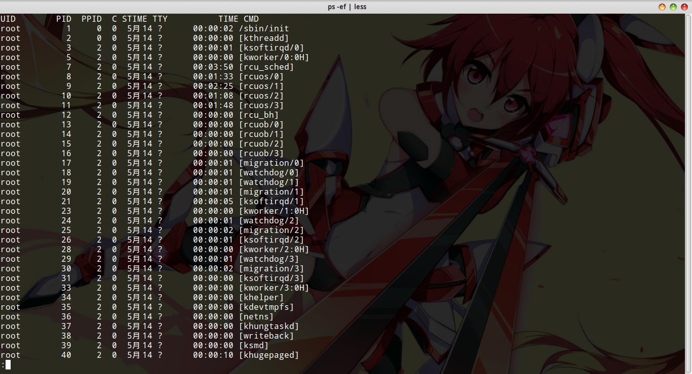
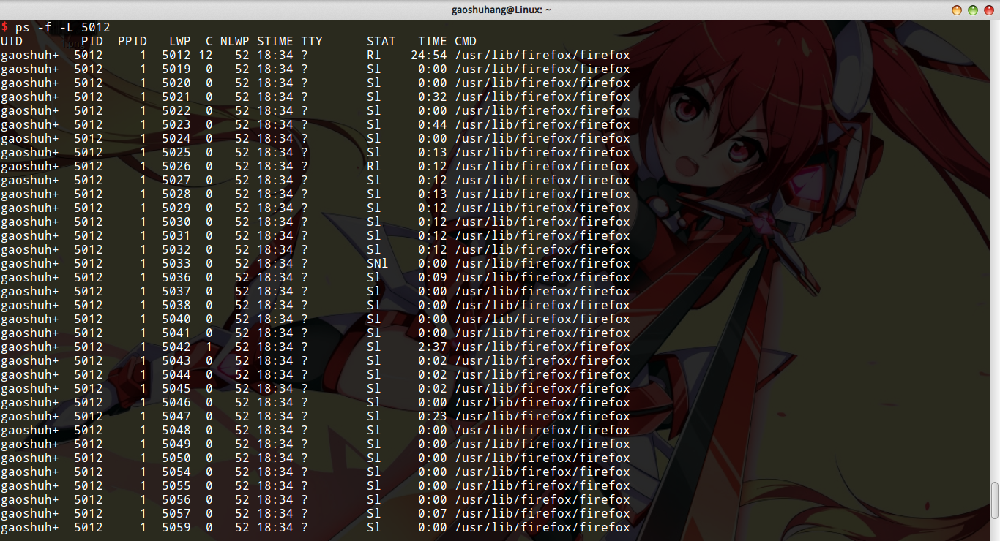

# ps命令

查看系统当前所有进程状态的快照。

```
ps [options]
```

ps命令选项比较复杂，而且支持三种命令行参数规范（UNIX BSD GNU），具体命令参数可以参考man手册，这里就不把手册全部翻译一遍了，我们直接列出一些常见的命令，以备随时查阅。本文统一使用UNIX风格。

## 列出所有进程

```
ps -ef
```

* `-e` 显示所有进程
* `-f` 全格式输出

建议配合管道和less，grep等使用。例如查询某个名字的进程时可以使用grep。当然ps提供了相关选项`-C`，能够按进程命令选择，但经常我们记不起进程的命令。由于查询结果较长，因此建议配合less或输出到文件。

### 输出含义



* `UID` 用户ID
* `PID` 进程ID
* `PPID` 父进程ID
* `C` CPU占用率
* `STIME` 开始时间
* `TTY` 开始此进程的终端设备
* `TIME` 该进程运行的总时间
* `CMD` 运行可执行文件的命令

## 根据PID选择进程

```
ps -f -P <pid>
```

* `-P` 按进程号过滤

注意，无论何时都加上`-f`比较好，显示信息全。

## 根据进程号查看进程所有线程

```
ps -f -L <pid>
```

* `-L` 根据进程号选择所有线程

### 输出含义

如图，我查看了`firefox`火狐浏览器的所有线程。



* `LWP` 线程标识符
* `NLWP` 该进程线程数
* `STAT` 线程状态
