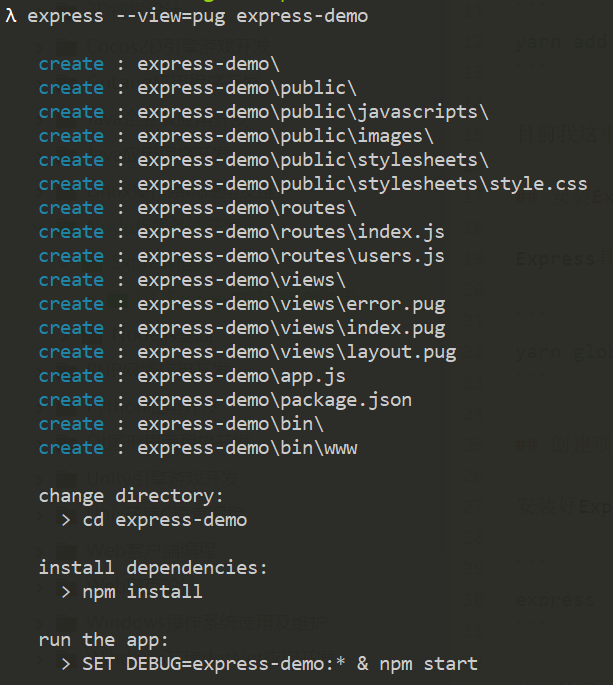
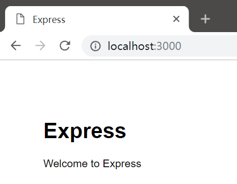
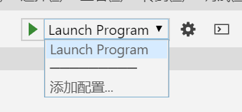

# Express安装和简单使用

Express是Node生态中，一个应用广泛的HTTP服务端开发框架，曾经非常流行的号称JavaScript全栈解决方案的MEAN（MongoDB，Express，Angular，NodeJS）就包括了Express，和其它各种框架相比，Express非常的轻量级，而且设计优良，唯一的缺点就是使用了JavaScript这门语言（滑稽）。这里我们简单了解一下这个框架。

注：这里包管理器使用`yarn`，使用`npm`也是一样的效果。

## 在项目中安装Express

使用`yarn init`初始化一个项目，然后安装Express相关的依赖：

```
yarn add express
```

目前我这里安装的版本是`4.16.4`。

## 安装Express命令行工具

Express具有一个能创建项目的命令行工具，就像`create-react-app`或`vue-cli`那样，我们可以将其全局安装：

```
yarn global add express-generator
```

## 使用express命令创建项目

安装好Express命令行工具后，我们可以使用`express`命令创建项目。

```
express --view=ejs express-demo
```

注：这里`--view=ejs`表示模板引擎使用`ejs`。

Express默认的模板引擎是`pug`，该模板之前叫`Jade`大家应该都听说过，但是这个名字和一个商标重名了，不得已改名为`pug`。其实很多前后端分离的项目可能根本用不上模板引擎，而且这个`pug`也基本是我见过的最难用的模板引擎了，如果一定要使用一个后端模板引擎，我会用`ejs`，它写起来很麻烦，像JSP一样，但是符合一般人的思路。

[https://www.npmjs.com/package/ejs](https://www.npmjs.com/package/ejs)



图中列出了命令行工具为我们生成的目录结构，同时提示我们如何安装依赖、运行项目，我们按照指引操作即可正确运行。



注：Express功能非常简单，其实我们不使用命令行工具创建项目也是完全可以的，只不过自动生成的项目中有不少预先写好的代码，我们可以参照这些，在此基础上编写。

## 修改自动重启

Node中我没发现什么热更新方案，好在Node服务重启也是非常快的，有很多监测文件系统修改，并自动重启的小工具，比如`nodemon`。

```
yarn global add nodemon
```

我们在`package.json`中可以配置`nodemon`为开发过程中的启动命令：

```json
"scripts": {
  "start": "node ./bin/www",
  "dev": "nodemon ./bin/www"
}
```

当然，如果使用VSCode，因为重启这个动作有个按钮，也就省的用`nodemon`了。

## 调试

在VSCode中可以创建一个`Node.js`的调试配置用来调试Express，这样我们的断点就可以生效了。



配置一般留作默认就行。

## 编写Express应用

Express框架功能其实是相当精简的（相比Java之类的技术来说），我们其实不用搞一本大部头的书研究「基于XX技术的大型XX项目开发」，也完全没有这样的书，我们如果会JavaScript，建好项目后就可以开始写了。

HTTP服务端框架有几个最核心的功能：路由，请求参数获取，响应设置。这些内容我们直接看Express的API文档即可：[https://expressjs.com/en/4x/api.html](https://expressjs.com/en/4x/api.html)
