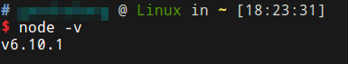
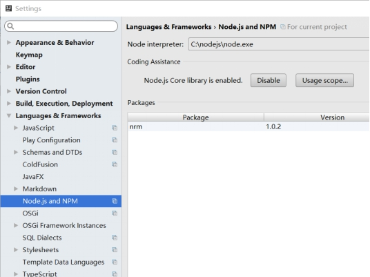

# Node.js简介

JavaScript最初被设计为浏览器端执行的脚本语言，专门用于操作HTML的DOM结构，为了执行JavaScript脚本，Chrome浏览器中内置了高性能的V8引擎。Node.js的作者则将V8引擎抽取出来，并编写了一套库，使得JavaScript可以编写服务端程序，Node.js就这样诞生了。

JavaScript是一个事件驱动的语言，Node.js利用这个特点，能让开发人员较简单的编写出基于事件驱动的高性能服务端程序，同时，V8引擎本身也比较先进，具有很好的性能，因此Node.js在IO密集型应用领域是一个值得考虑的方案。除此之外，Node.js的出现极大的丰富了JavaScript语言的生态，目前许多流行的前端工具都是由JavaScript本身编写的，不会使用Node.js和npm，也同样难以迈入前端开发的门槛。

另一方面，JavaScript的生态还很年轻，技术更新很快，难免导致发展比较畸形，对此我们应该理性看待，不要盲目跟风，也不要无脑黑，这些问题都会随着这门技术越来越成熟而得到改观。

# Node.js环境搭建

## Ubuntu系统下搭建

### 安装最新Node.js

打开nodejs官网，找到download


执行官网的安装命令，添加nodejs源，这个过程可能有点慢，注意：现在nodejs版本号飚的非常快，`6.x`版本估计很快就过时了

```shell
curl -sL https://deb.nodesource.com/setup_6.x | sudo -E bash -
sudo apt-get install -y nodejs
```

安装成功后如下图



## Windows系统下搭建

### 下载安装Node.js


下载LTS长期支持版，LTS版本的支持周期为两年。6.x发布时间约为2016年4月。

下载后得到node-v6.10.1-x64.msi文件，双击安装。安装过程中，会自动添加环境变量，不用手动添加。

## 编写hello，world并运行

hello.js
```javascript
var http=require('http');
http.createServer(function (request,response){
    response.writeHead(200,{'Content-Type':'text/plain'})
    response.end("hello,world\n");
    }).listen(8080);

console.log('Server runing at http://127.0.0.1:8080');
```

### 使用：node hello.js运行脚本


### 打开浏览器可以看到运行成功


## 使用Intellij IDEA集成开发Node.js

在plugins中搜索nodeJs，安装插件，安装完成后重启IDE。新建项目，就能找到node选项了。不过这个插件默认使用express框架，不安装express创建项目会报个错，不过也不影响使用。


除此之外，还要打开编辑器的nodejs支持，如下图所示，为点击enable之后结果。



写好代码后，点击右键菜单的Create 'hello.js'，可以生成nodejs的运行配置，然后点击运行即可。


