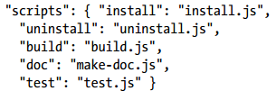

# npm包和依赖库

我们编写的Node.js工程通常会依赖一些npm包，比如web应用开发需要的`express`等，同理我们也可以编写我们自己的npm包，这篇笔记记录这些npm包的文件结构，以便于我们更好的使用它们。

## npm包的结构

node的包结构参考commonJS定义，通常一个包中具有以下几个文件和文件夹：

* package.json 包描述文件
* bin 可执行文件
* lib javascript代码
* doc 文档
* test 单元测试用例

其中我们比较关注的就是`package.json`，这个文件中的描述信息就大致介绍了这个包是做什么用的。

## package.json

一个package.json的例子
```json
{
  "name": "node",
  "version": "1.0.0",
  "description": "",
  "main": "app.js",
  "scripts": {
    "test": "echo \"Error: no test specified\" && exit 1"
  },
  "author": "",
  "license": "ISC",
  "dependencies": {
    "express": "^4.16.3"
  }
}
```

`package.json`不光应用在标准的npm包中，我们编写的Node.js工程最好也编写一个`package.json`，这个文件的有如下几个主要作用：

* 包含了项目的描述信息，项目名、版本、描述等等
* 包含了项目的依赖，我们项目目录中的`node_modules`通常是不会放到版本控制中的，其他人拿到我们的项目会根据`package.json`，使用`npm install`命令自动下载依赖
* 像make等构建工具一样，`package.json`中，`scripts`属性里包含了一些运行命令，可以使用npm工具执行，比如启动项目、测试项目等

### package.json中的必要字段

* name 包名
* description 包简介
* version 版本号
* keywords 关键词数组，用于npm分类索引
* repositories 托管源代码的位置列表
* author 包作者
* bin 包可以包含cli工具，通过npm全局安装就能使用这些工具，bin包含可执行文件路径
* main 模块的入口
* scripts 脚本说明对象，用于包管理器安装、编译、测试、卸载包。示例：



* engines 支持的javascript引擎列表
* dependencies 运行时依赖包
* devDependencies 开发依赖包

# npm工具

请看考 开发工具链/npm 章节。
