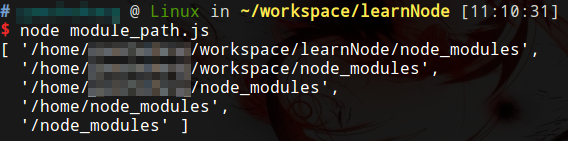

# Node.js中的模块

Node.js中的模块分为核心模块和文件模块：

**核心模块**：node提供的模块，在node源码编译过程中被编译成二进制文件。node启动时，部分核心模块直接加载进内存，在路径分析中优先判断。

**文件模块**：用户编写的模块，运行时动态加载，速度比核心模块慢。

## CommonJS

CommonJS是一个JavaScript中的模块定义规范，node参考了CommonJS对模块的定义，下面介绍如何定义和引用模块。

### 引用模块

我们使用`require`可以引用一个模块。

```javascript
var os = require("os");
var archStr = os.arch();
console.log(archStr);
```

输出
```
x64
```

上面示例代码中，我们引用了一个叫做`os`的模块，这个模块中的函数`arch()`能够输出电脑CPU的架构。

### 模块定义

我们可以自定义一个`js`作为模块，用exports可以导出当前模块的方法或变量，exports是module的属性。引用该模块的文件通过require引入即可。下面我们简单些一个自定义模块的例子。

自定义模块 myModule.js
```javascript
var sum = function(a, b) {
    return a + b;
};

module.exports.sum = sum;
```

调用模块 app.js
```javascript
var myModule = require("./myModule");
console.log(myModule.sum(1, 2));
```

注意：模块名就是模块的文件名，它需要符合小驼峰命名，可以没有文件后缀名"js"，不必考虑变量污染。

## 模块的路径

上面代码中，我们把`myModule`和`app`放在了同一个目录下，因此我们使用`require`引入模块时，路径使用了`./myModule`，以此表示引用的模块文件和当前文件在同一个目录下，我们同样可以使用绝对路径进行模块路径的指定。

如果不明确指定模块的路径，会按照如下搜索顺序进行模块查找：



如图所示，会按照从当前路径的node_modules到根目录的node_modules的顺序查找。如果我们在工程目录中建立一个`node_modules`文件夹，并把我们的自定义模块放进去，就可以不用明确指定模块路径了。

## 模块缓存

node会对引入过的模块进行缓存，加快模块的加载速度，核心模块和文件模块都会缓存。

## 使用package.json的模块

这里不做叙述，详见包管理和npm章节。

## 模块加载过程的理解

node在加载模块时将模块包装成一个闭包，类似这样的：

```javascript
(function (exports, require, module, __filename, __dirname) {
    // module code...
});
```

* module：模块本身
* exports=module.exports={}

使用require加载模块，调用者得到module.exports。所以这里产生了一个问题，暴露方法时，用module.exports还是exports。这里建议全用module.exports。

因为exports在上面代码中，只是一个形参，用它暴露属性、方法是没问题的，但是暴露类如exports=obj就错了，这相当于在函数体内更改形参引用，是没有效果的。
