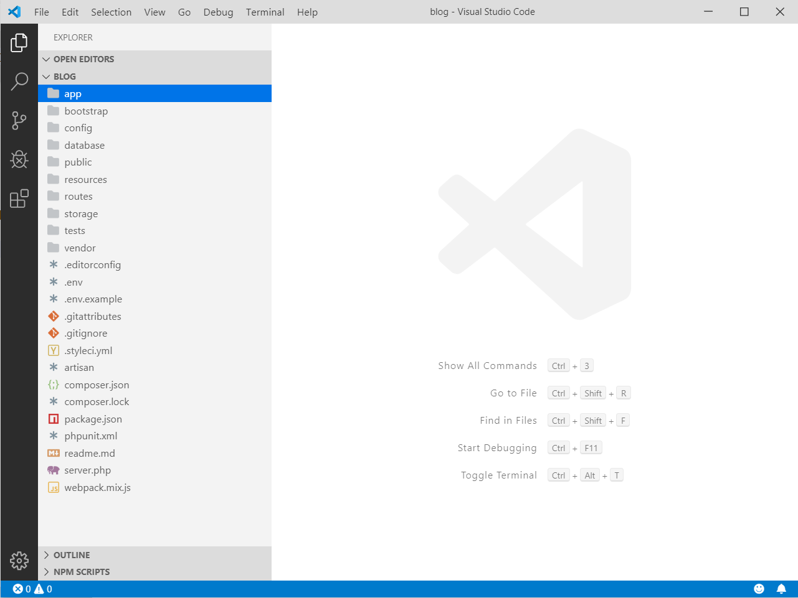

# Laravel开发环境搭建


Laravel是一个时下非常流行的PHP开发框架，这个框架基于composer进行构建，设计吸取了ROR等框架的优点，在许多开发人员中评价都不错。当然，它的缺点也相对明显，Laravel的性能奇差，另一方面，它设计的实在是复杂，和原生PHP开发相差很大，很多人认为Laravel这种重型框架失去了PHP这门语言的初衷。

无论如何，Laravel现已得到了广泛的使用，并且更新速度非常之快，这里我们就简单学习体验一下Laravel。

Laravel官网：[https://laravel.com/](https://laravel.com/)

注：Laravel版本更新非常快，本系列笔记刚开始写的时候版本还是`5.8`，但是学着学着主版本就到`6.0`了，而且该版本是长周期支持版，因此本系列笔记参考文档的版本为`6.0`。

## 环境搭建

Laravel环境搭建比较复杂，而且PHP本身环境就比较难搞，composer也基本是我见过的最差的包管理器（LOGO还特别丑），因此这里也是尝试了半天才将初始工程运行起来。

### Windows开发环境搭建

Laravel官网对文档对PHP扩展要求进行了说明，但可能不全，我们按照官网工程搭建一步步来，遇到错误再找对应的办法就行了。

我这里使用的是PHP7.2.22，开启了以下扩展：

```ini
extension=php_curl.dll
extension=php_fileinfo.dll
extension=php_mbstring.dll
extension=php_mysqli.dll
extension=php_openssl.dll
extension=php_pdo_mysql.dll
```

创建项目：
```
composer create-project laravel/laravel blog
```

Laravel即使创建空项目也有很多依赖包，因此务必要添加`composer`的国内镜像，而且第一次创建项目将会非常漫长（还可能有某个包偶然下载失败的情况），请耐心等待。

用PHP内置服务器启动项目：
```
php artisan serve
```

启动浏览器，访问调试服务器的默认端口`8000`即可。


注：`artisan`是Laravel中一个PHP命令行工具。

## 项目目录结构

新建一个空项目后，我们可以看到其实已经创建了一大堆文件：



```
|_app 我们工程大部分代码都在这里编写，包括控制器、模型、自定义命令行工具等
|_bootstrap Laravel框架自身启动相关的代码
|_config 我们工程的配置目录，我们需要修改其中的配置使其符合我们的要求
|_database 包括数据迁移代码、模型工厂类、种子数据等
|_public 站点的静态数据
|_resources 包括视图模板，以及未编译的资源如JavaScript、Less等
|_routes 路由配置
|_storage 站点的运行时文件目录，我们应用产生的一些文件也可以放置在这里
|_tests 存放测试相关代码
|_vendor 存储composer依赖
```

## Nginx部署

Laravel官网文档给出了一份配置文件例子，修改下基本就可以使用了：

```
server {
    listen 80;
    server_name example.com;
    root /example.com/public;

    add_header X-Frame-Options "SAMEORIGIN";
    add_header X-XSS-Protection "1; mode=block";
    add_header X-Content-Type-Options "nosniff";

    index index.html index.htm index.php;

    charset utf-8;

    location / {
        try_files $uri $uri/ /index.php?$query_string;
    }

    location = /favicon.ico { access_log off; log_not_found off; }
    location = /robots.txt  { access_log off; log_not_found off; }

    error_page 404 /index.php;

    location ~ \.php$ {
        fastcgi_pass unix:/var/run/php/php7.2-fpm.sock;
        fastcgi_index index.php;
        fastcgi_param SCRIPT_FILENAME $realpath_root$fastcgi_script_name;
        include fastcgi_params;
    }

    location ~ /\.(?!well-known).* {
        deny all;
    }
}
```

除此之外，文档中也给出了一些优化Laravel性能的建议。

composer加载器优化：

```
composer install --optimize-autoloader --no-dev
```

配置信息加载优化：

```
php artisan config:cache
```

路由加载优化：

```
php artisan route:cache
```
