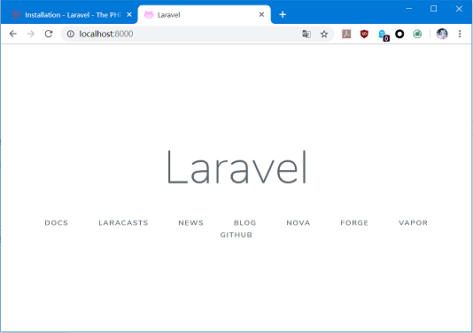

# Laravel开发环境搭建

Laravel是一个时下非常流行的PHP开发框架，这个框架基于composer进行构建，设计吸取了ROR等框架的优点，在许多开发人员中评价都不错。当然，它的缺点也相对明显，Laravel的性能奇差，另一方面，它设计的实在是复杂，很多人认为Laravel这种重型框架失去了PHP这门语言的初衷。

无论如何，Laravel现已得到了广泛的使用，并且更新速度非常之快，这里我们就简单学习体验一下Laravel。

Laravel官网：[https://laravel.com/](https://laravel.com/)

## 环境搭建

Laravel环境搭建非常复杂，而且坑比较多，PHP本身环境就比较难搞，而且composer也基本是我见过的最差的包管理器（LOGO还特别丑），因此这里也是尝试了半天才将初始工程运行起来。

### 虚拟机环境

在Windows本地搭建就不用考虑了，这里我们直接起个Ubuntu16.04的虚拟机作为开发环境，也有很多建议用`vagrant`和Laravel提供的`homestead`虚拟机环境（使用搭好的环境能够简单很多），这里就自行根据部署环境进行选择即可。

假设这里我们新创建了一个Ubuntu Server16.04虚拟机，用户名、密码、root密码都为`ubuntu`。

在`/etc/apt/sources.list`设置阿里云软件源镜像：
```
deb http://mirrors.aliyun.com/ubuntu/ xenial main restricted universe multiverse
deb http://mirrors.aliyun.com/ubuntu/ xenial-security main restricted universe multiverse
deb http://mirrors.aliyun.com/ubuntu/ xenial-updates main restricted universe multiverse
deb http://mirrors.aliyun.com/ubuntu/ xenial-backports main restricted universe multiverse
```

更新apt缓存：
```
sudo apt-get update
```

安装LNMP全套开发环境：
```
sudo apt-get install nginx php7.0 php7.0-fpm php7.0-mbstring php7.0-zip php7.0-xml php-xdebug composer mysql-server
```

安装MySQL过程中，方便起见，我们建一个用户名和密码都为`root`的用户用来开发。

设置`/etc/php/7.0/fpm/php.ini`启用调试器：
```
zend_extension=/usr/lib/php/20151012/xdebug.so
xdebug.remote_enable=1
xdebug.remote_handler=dbgp
xdebug.remote_mode=req
xdebug.remote_host=127.0.0.1
xdebug.remote_port=9000
xdebug.max_nesting_level=300
```

设置composer镜像：
```
composer config -g repo.packagist composer https://packagist.phpcomposer.com
```

修改Nginx配置`/etc/nginx/sites-available/default`：
```
location ~ \.php$ {
  include snippets/fastcgi-php.conf;
  fastcgi_pass unix:/run/php/php7.0-fpm.sock;
}
```

修改MySQL配置`/etc/mysql/mysql.conf.d/mysqld.cnf`以允许其他IP访问数据库服务器：
```
bind-address = 0.0.0.0
```

登入数据库，修改`root`用户登入主机控制：
```sql
use mysql;
update user set host = '%' where user = 'root';
```

这样，在外部我们就可以用导航猫连接数据库了。

搭建工作区目录：把`/var/www/html`用`chown`修改所属为当前用户，并软链接到家目录方便操作。

### Hello World

进入工作区，执行创建工程命令：
```
composer create-project laravel/laravel demo01 ^5.5
```

等了很久之后，下载了一堆依赖，工程就创建完成了，但是还需要一些配置才能运行。进入工程目录：
```
cp .env.example .env
php artisan key:generate
```

我们使用浏览器访问虚拟机中对应目录即可看到运行成功的页面。


