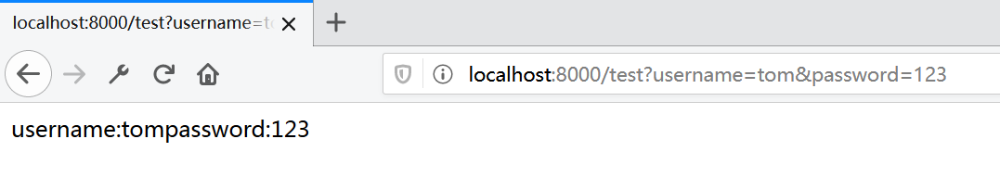
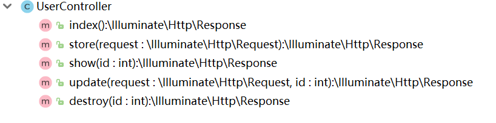

# 控制器组件

控制器作为MVC模式中的`Controller`，用于接收HTTP请求，返回HTTP响应。各种Web框架都对控制器编写以及请求响应模型做了良好封装，这里我们学习下Laravel中如何编写控制器。

## 创建控制器

Laravel中，所有和Web相关的控制器都放在`app/Http/Controllers`下。


我们可以使用`artisan`命令创建一个新的控制器：

```
php artisan make:controller DemoController
```

默认生成的代码：

```php
<?php

namespace App\Http\Controllers;

use Illuminate\Http\Request;

class DemoController extends Controller
{
    //
}
```

如果我们创建的控制器在`Controllers`的更深层次下，我们可以直接在命令中指定`Controllers`后续的包目录结构，例子：

```
php artisan make:controller Customer/CustomerController
```

这里不推荐手动创建控制器，因为使用`artisan`命令创建控制器，能够自动生成基础代码、命名空间声明和包目录结构，手动创建容易出错。

## 读取HTTP请求参数

控制器的基本逻辑就是`读取HTTP请求参数->业务逻辑处理->返回HTTP响应`。我们这里编写一个简单的例子，直接将请求输出为字符串。

DemoController.php
```php
<?php

namespace App\Http\Controllers;

use Illuminate\Http\Request;

class DemoController extends Controller
{
    public function index(Request $request)
    {
        $username = $request->input('username');
        $password = $request->input('password');

        return 'username:' . $username . 'password:' . $password;
    }
}
```

`$request`参数由Laravel框架自动注入，我们可以通过`$request->input()`来读取HTTP请求参数，如果读取的参数不存在，则返回`null`。我们直接返回一个字符串，Laravel会自动帮我们将其组装为一个HTTP响应，返回给浏览器。

注：`public function index(Request $request)`是PHP7的类型约束写法，它指定该方法参数必须是`Request`类型。如果不写明约束的类型，Laravel无法注入该参数。

web.php
```php
Route::get('/test', 'DemoController@index');
```

仅编写控制器还不够，我们需要在路由配置文件中进行配置。有关Web的配置我们可以直接写在`routes/web.php`中，上面代码指定可以使用`GET`方法，请求路径为`/test`，处理逻辑为`DemoController`的`index`方法。



## 读取REST风格的路径参数

类似`students/1`这样REST风格的路径参数读取，和普通参数写法不同。

```php
<?php

namespace App\Http\Controllers;

use Illuminate\Http\Request;

class StudentController extends Controller
{
    public function show($id)
    {
        return 'id'.$id;
    }
}
```

路径参数会直接注入控制器的参数中。

```php
Route::get('/students/{id}', 'StudentController@show');
```

路由配置中，需要用占位符指定路径参数。

## 资源控制器

通常一个管理系统中，少不了针对数据模型的大量增删改查操作，我们可以直接生成一个这样能应用于增删改查的`资源控制器`。

创建资源控制器：

```
php artisan make:controller StudentController --resource
```


指定`--resource`方法生成的控制器能够自动帮我们生成增删改查对应的方法。这里为了方便理解，以学生管理为例进行说明：

| HTTP方法 |         URI         |  动作   |               说明 |
| :------- | :-----------------: | :-----: | -----------------: |
| GET      |      /students      |  index  |   查询学生列表页面 |
| GET      |  /students/create   | create  | 创建学生的表单页面 |
| POST     |      /students      |  store  |           创建学生 |
| GET      |   /students/{id}    |  show   |   查询指定学生页面 |
| GET      | /students/{id}/edit |  edit   |   编辑指定学生页面 |
| PUT      |   /students/{id}    | update  |       编辑指定学生 |
| DELETE   |   /students/{id}    | destroy |       删除指定学生 |

这七个方法包含了一个通用的增删改查控制器模型。

路由配置：

web.php
```php
Route::resource('students', 'StudentController');
```

在路由配置中，我们可以直接使用`Route::resource`指定资源控制器，不需要手动写七个方法的路由。

注：在使用后端模板的开发方式中，浏览器表单是无法发起`PUT`和`DELETE`请求的，因此Laravel支持为GET或POST添加一个`_method`参数指定请求类型，资源路由会做对应的处理。

## API资源控制器

前面介绍的资源控制器是适用于基于后端模板的开发方式的，对于前后端分离开发，我们不需要`create`、`edit`这种返回表单页面的方法。这种情况Laravel中可以创建一个API资源控制器。

创建API资源控制器：

```
php artisan make:controller StudentController --api
```

生成的代码结构：



路由配置：

web.php
```php
Route::apiResource('students', 'StudentController');
```
