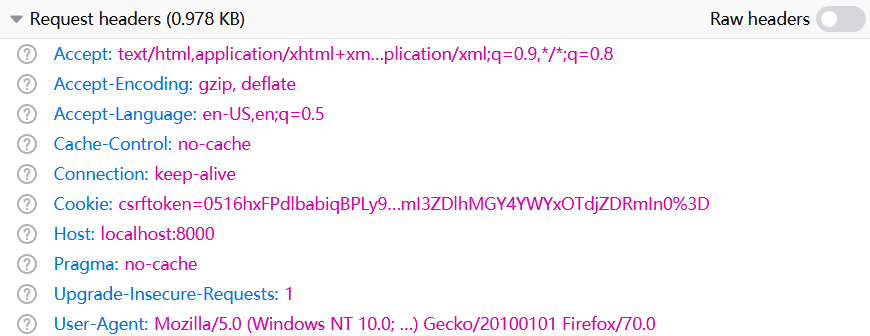
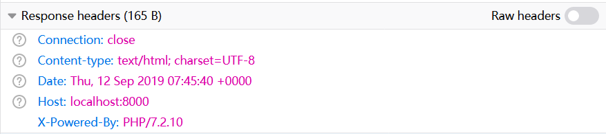

# HTTP请求和响应

前一篇笔记我们学习了Laravel中控制器的用法，这里我们再仔细了解一下Laravel中的请求（Request）和响应（Response）对象。它们的类全名分别是：

```
Illuminate\Http\Request
Illuminate\Http\Response
```

本篇笔记记录请求和响应对象的使用方法。有关文件上传下载的内容，将在后文介绍。

## 请求 Request

Laravel对HTTP请求进行了封装，便于我们获取请求参数、请求方法、请求地址、请求头等信息。



### 请求参数和路径参数

传统的HTTP请求形如`student?id=1`，REST风格的请求形如`students/1`，原生PHP对第一种形式已经进行了封装，但是对第二种形式，只能手动解析，比较麻烦。好在大多数Web框架都针对REST风格的请求做了封装。

#### 请求参数

传统类型的请求参数可以通过`$request->input()`读取。

```php
<?php

namespace App\Http\Controllers;

use Illuminate\Http\Request;

class UserController extends Controller
{
    public function show(Request $request)
    {
        $id = $request->input('id');
        return 'id='.$id;
    }
}
```

注：如果读取的参数不存在，将返回`null`。

路由配置中，需要配置对应的请求地址和控制器方法。

```php
Route::get('/users', 'UserController@show');
```

#### 路径参数

REST风格的路径参数可以通过依赖注入的形式，传递给控制器方法。

```php
<?php

namespace App\Http\Controllers;

use Illuminate\Http\Request;

class UserController extends Controller
{
    public function show(int $id)
    {
        return 'id='.$id;
    }
}
```

路由中，路径配置需要对应的占位符。

```php
Route::get('/users/{id}', 'UserController@show');
```

### 获取请求属性

除了请求参数，HTTP请求报文中还包含请求方法、请求URI、请求头等有用的信息，这些都封装在`$request`对象中。

假设我们使用浏览器访问`http://localhost:8000/users?id=1`，可以通过如下代码获取请求对象中的各种信息：

```php
// 请求方法
$method = $request->method();
// 请求URI，例如：users
$path = $request->path();
// 请求路径URL，例如：http://localhost:8000/users
$url = $request->url();
// 请求带参数URL，例如：http://localhost:8000/users?id=1
$full_url = $request->fullUrl();
// 请求头
$user_agent = $request->header('User-Agent');
```

### 读取Json请求

除了表单形式的请求参数，和REST风格的路径参数，将请求内容封装成请求体中的Json对象也是常用的方式，尤其是当我们的表单非常复杂，带有很多动态配置的时候。

下面JavaScript代码中，我们使用`axios`上传一个Json对象：

```javascript
var jsonObj = {
    username: 'Jerry',
    password: 'abc123',
    courseList: [
        {id: 1, name: 'Math'},
        {id: 2, name: 'English'}
    ]
};
axios.post('/test', jsonObj)
    .then((rsp) => {
    console.log(rsp);
});
```

该请求的`Content-Type`为`application/json;charset=utf-8`，Laravel会自动识别该请求类型，我们可以直接从注入控制器的`$request`对象中读取转换到PHP的关联数组。

```php
// 获取请求Json对象
$req_json = $request->input();
```

## 响应 Response

Laravel对HTTP响应也进行了封装，基于后端模板的MVC开发中，HTTP响应通常是一个视图模板，而前后端分离开发中，响应则可能是一段Json。



### 响应到视图

实际上，各种Web框架反反复复的发明了许多“模板引擎”，让人不胜其烦。Laravel使用的是叫做的Blade模板引擎，相对来说算是比较好用的一个。

下面代码中，`index`方法会返回一个视图模板，`response()->view('demo')`中参数字符串对应的就是模板的名字，该模板文件位于`resources/views/demo.blade.php`。

```php
<?php

namespace App\Http\Controllers;

use Illuminate\Http\Request;

class UserController extends Controller
{

    public function index()
    {
        return response()->view('demo');
    }
}
```

当然，模板中肯定是要填充数据的，数据可以通过关联数组的形式进行填充。下面代码中，我们在填充了一个字符串变量。

```php
$data = 'Hello, laravel!';
return response()->view('demo', ['data' => $data], 200);
```

注：第三个参数是可选的HTTP响应状态码，默认为`200`，一般可以省略。

模板中直接访问`$data`即可：

```php
<div>{{$data}}</div>
```

有关Blade模板的用法，具体将在后文介绍。

### 输出Json

在前后端分离的开发方式中，控制器的响应一般是Json格式。我们可以用`response()->json()`，直接将一个关联数组作为参数返回即可。

```php
return response()->json([
    'username' => 'Tom',
    'password' => 'abc123'
]);
```

Laravel会自动帮我们设置好`Content-Type: application/json`响应头，告知浏览器响应数据的媒体类型，我们不需要像原生PHP开发一样手动设置了。

### 重定向

除了直接返回数据，重定向响应也非常常见，例如：登陆成功跳转到网站内部页面，付款完成跳转到订单成功页面等。重定向有多种实现方式：

1. 使用`302`状态码和响应头中的`Location`实现
2. 根据Ajax响应，使用JavaScript的`location.href=xxx`进行跳转
3. 响应一个跳转专用页面，使用JavaScript进行倒计时跳转

第1种方式在基于后端模板的开发中比较常用，第2种在现代的前后端分离开发中更常用（第3种用户体验差，给人感觉也比较low，除非业务逻辑前两种方式真的无法实现，否则不会用到）。

这里Laravel作为一个后端框架，我们介绍的是第一种方式。

### 重定向到路由路径

下面代码中，我们返回的响应让浏览器重定向到`/`。

```php
return redirect('/');
```

### 带参数重定向

如果想在重定向中携带参数，一般是通过Session实现的，但是我们不用手写这个功能，因为Laravel已经帮我们封装好了。我们直接使用`redirect()->with()`。

```php
return redirect('/')->with('key', 'abc123');
```

在模板中，我们直接读取Session即可：

```php
<div>{{session('key')}}</div>
```

注：该方式存储在Session中的数据只会保持到下一次请求，以避免污染到除该次重定向外的请求。

### 重定向到外部路径

在极少情况下，我们可能需要重定向到其它域名。这可以通过`redirect()->away()`来实现：

```php
return redirect()->away('https://www.google.com');
```
