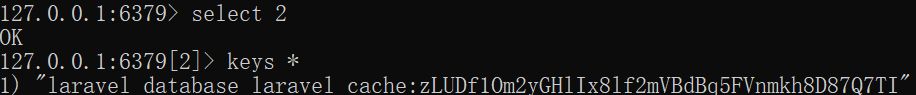
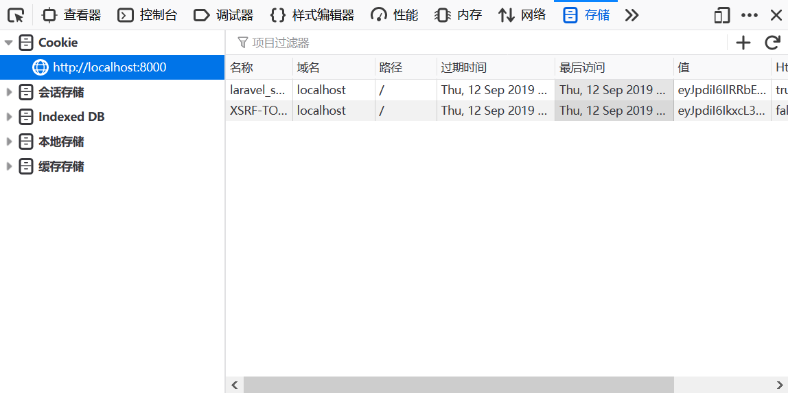

# Cookie和Session

HTTP是基于请求响应的无状态协议，因此为了实现客户端会话关联的信息存储，需要用到Session和Cookie，具体原理这里就不多说了，参考笔记中的网络、Java、PHP等相关章节均有介绍。

这里我们主要关注Laravel对Cookie和Session的使用做了哪些封装。

## Session

Session是存储在服务端的键值对数据，浏览器只通过存储在Cookie中的`sessionId`和服务端会话缓存中的数据进行关联。我们需要将要避免客户端篡改的数据存储在Session中，比如包含敏感信息的用户对象、用户权限、一些敏感的状态信息等。

### 配置缓存中间件

Laravel中，支持将Session缓存到文件（默认）、数据库、Redis、Memcached。通常，我们自己的个人网站直接缓存到文件比较方便，它位于工程目录中的`storage/framework/sessions`，而对性能要求更高的场景一般缓存在Redis或Memcached，这里只介绍前者。

PHP连接Redis需要安装`php_redis`这个扩展，具体可以参考`PHP网络应用开发/扩展库/连接redis`章节。Laravel官网文档中使用的是一个叫做`predis`的`composer`扩展，安装难，配置坑，性能差，这里就不用了。

装好`php_reids`后，还需要在工程配置文件中进行Session缓存的中间件配置。首先在`database.php`中，加入一个Redis连接：

```php
'redis' => [

    'client' => env('REDIS_CLIENT', 'phpredis'),

    'options' => [
        'cluster' => env('REDIS_CLUSTER', 'redis'),
        'prefix' => env('REDIS_PREFIX', Str::slug(env('APP_NAME', 'laravel'), '_').'_database_'),
    ],

    // ...此处省略默认的default和cache，下面是新加的用于缓存session

    'session' => [
        'url' => env('REDIS_URL'),
        'host' => env('REDIS_HOST', '127.0.0.1'),
        'password' => env('REDIS_PASSWORD', null),
        'port' => env('REDIS_PORT', 6379),
        'database' => env('REDIS_CACHE_DB', 2),
    ],
],
```

注意：生产环境中，Redis一般有用户名和密码，这些都需要进行正确的配置。此外，还要注意Redis所选的数据库，这里我们使用的是数据库`2`。

然后修改`session.php`，将其中`driver`处改为`redis`：

```php
'driver' => env('SESSION_DRIVER', 'redis'),
```

另外，`connection`这里默认由`.env`控制，我们需要将该字段修改为`session`对应`database.php`中的`redis`配置，我们可以删掉或者修改`.env`中的`SESSION_CONNECTION`。

```php
'connection' => env('SESSION_CONNECTION', 'session'),
```

我们可以在`redis-cli`中，切换到对应的数据库查看结果：



### Session的读写用法

#### 读取Session

读取Session非常简单，我们可以通过请求对象得到Session对象：

```php
$test_key = $request->session()->get('test_key');
```

如果Session中无该键，则返回`null`。

但因为Session非常常用，Laravel封装了全局辅助函数，我们连请求对象也可以省了：

```php
$test_key = session()->get('test_key');
```

#### 写入Session

写入Session例子如下：

```php
session()->put('test_key', 'hello');
```

实际上，Session值不仅可以是字符串，我们一般还会使用关联数组保存一个稍微复杂的数据结构：

```php
session()->put('test_key', ['name'=>'tom', 'password'=>'123']);
```

#### 闪存Session

Laravel支持能够将Session写入后，仅供读取一次。

```php
session()->flash('test_key', 'hello');
```

#### 删除Session

`session()->forget()`可以删除单个Session键，`session()->flush()`可以删除全部Session键。

```php
// 删除单个键
session()->forget('test_key');
// 删除所有键
session()->flush();
```

## Cookie

和Session不同，Cookie是缓存在浏览器客户端的键值对，因为位于客户端，因此用户篡改起来也是非常的方便，将一些安全敏感的信息保存在Cookie中的做法非常危险。



提醒：在控制器方法中，如果在返回HTTP响应前使用`dump()`，将无法正确设置Cookie（包括Session需要的`sessionId`），在调试时要注意这点。

### 读取和设置Cookie

设置Cookie可以通过设置HTTP响应体实现，下面代码设置了一个键为`test`，值为`hello`的Cookie。

```php
return response()
    ->view('demo', ['data' => $data], 200)
    ->cookie('test', 'hello'， 60);
```

注意参数，第一个是键，第二个是值，第三个是超时时间，单位是分钟。如果不设置超时，默认会话时间内有效。既然可以设置Cookie的超时，那么将超时时间设置为`0`，自然就可以实现删除Cookie了。

读取Cookie也很简单，直接从请求对象中读取就可以：
```php
$test = $request->cookie('test');
```


