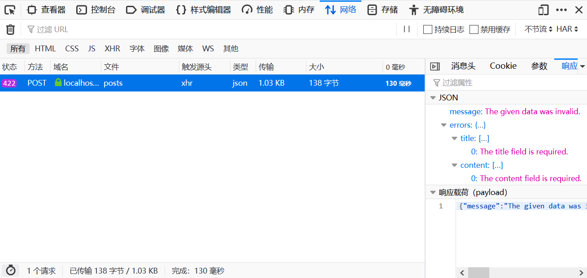

# 表单验证

Web框架的表单验证功能都是鸡肋。

在实际开发中，我们的表单可能非常复杂，而且区分前后端，和框架紧耦合的后端表单验证功能很死板，导致我们免不了大量混写预制的验证规则和自己的验证规则，而且多人合作时大家的水平也参差不齐，代码很快就失去了约束变得难以读懂，最后发现还不如把所有表单验证逻辑手写，都放控制器里方便。但这里我们还是简单了解一下Laravel中的表单验证功能。

## 使用validate()方法

下面是一个最简单的表单验证的例子：

PostController.php
```php
<?php

namespace App\Http\Controllers;

use Illuminate\Http\Request;

class PostController extends Controller
{
    public function create()
    {
        return response()->view('post');
    }

    public function store(Request $request)
    {
        $request->validate([
            'title' => 'bail|required|max:255',
            'content' => 'required',
        ]);

        return '提交成功';
    }
}
```

控制器代码中包含两个方法，`create()`返回一个视图，用于我们在浏览器上填写表单。`store()`处理浏览器发来的POST请求。如果通过验证，返回一个`提交成功`的字符串。

这里我们主要关注验证的写法，我们调用了`$request->validate()`，传入的参数是一个关联数组，包含的内容其实就是Laravel预制的验证规则。`title`字段中`bail|required|max:255`表示该字段为必须，最大长度为`255`字符，`bail`指定该字段当第一个验证规则不满足时不再继续向后验证。`content`字段也是同理。

post.blade.php
```html
<!doctype html>
<html lang="zh-cmn-Hans">
<head>
    <meta charset="UTF-8">
    <meta name="viewport"
          content="width=device-width, user-scalable=no, initial-scale=1.0, maximum-scale=1.0, minimum-scale=1.0">
    <meta http-equiv="X-UA-Compatible" content="ie=edge">
    <title>提交</title>
</head>
<body>
<div>
    <form action="/blog/posts" method="post">
        @csrf
        <div>
            <label for="post-title">标题</label>
            <input type="text" id="post-title" name="title" value="{{ old('title') }}" />
            @error('title')
                <div>{{ $message }}</div>
            @enderror
        </div>
        <div>
            <label for="post-content">内容</label>
            <textarea id="post-content" name="content">{{ old('content') }}</textarea>
            @error('content')
                <div>{{ $message }}</div>
            @enderror
        </div>
        <div>
            <input type="submit" value="提交" />
        </div>
    </form>
</div>
</body>
</html>
```

模板代码中，我们编写了一个表单，我们主要关注`@error`指令的写法，字段名作为参数传入，报错信息使用`$message`变量取出。

## 基于Ajax的验证

上面介绍的方法，验证组件和后端模板紧耦合，现在已经很少使用了。Laravel支持基于Ajax的表单验证，用起来非常简单方便。

```php
<?php

namespace App\Http\Controllers;

use Illuminate\Http\Request;

class PostController extends Controller
{
    public function create()
    {
        return response()->view('post');
    }

    public function store(Request $request)
    {
        $request->validate([
            'title' => 'bail|required|max:255',
            'content' => 'required',
        ]);

        return response()->json([
            'msg' => 'post success'
        ]);
    }
}
```

控制器代码和前面基本一样，只是把响应改成了一个Json，这样前端处理起来更友好一些。

注：之前在`HTTP请求和响应`章节已经介绍过了，Json请求和表单请求写法是一样的，Laravel会自动为我们进行处理。

```html
<!doctype html>
<html lang="zh-cmn-Hans">
<head>
    <meta charset="UTF-8">
    <meta name="viewport"
          content="width=device-width, user-scalable=no, initial-scale=1.0, maximum-scale=1.0, minimum-scale=1.0">
    <meta http-equiv="X-UA-Compatible" content="ie=edge">
    <script src="https://cdn.bootcss.com/axios/0.19.0/axios.min.js"></script>
    <title>提交</title>
</head>
<body>
<div>
    <form onsubmit="return false;">
        <input type="hidden" id="post-csrf-token" name="_token" value="{{ csrf_token() }}" />
        <div>
            <label for="post-title">标题</label>
            <input type="text" id="post-title" name="title" value="{{ old('title') }}" />
        </div>
        <div>
            <label for="post-content">内容</label>
            <textarea id="post-content" name="content">{{ old('content') }}</textarea>
        </div>
        <div>
            <input type="submit" value="提交" onclick="ajaxSubmit()" />
        </div>
    </form>
</div>
<script>
    function ajaxSubmit() {
        let tokenDom = document.querySelector('#post-csrf-token');
        let titleDom = document.querySelector('#post-title');
        let contentDom = document.querySelector('#post-content');
        axios.post('/blog/posts', {
            _token: tokenDom.value,
            title: titleDom.value,
            content: contentDom.value
        }).then((resp) => {
            console.log(resp);
        }).error((resp) => {
            console.log(resp);
        });
    }
</script>
</body>
</html>
```

上面模板代码中，我们把表单的默认提交行为禁用，并使用`axios`进行异步提交，写法相对复杂了很多，我们主要关注相比之前代码做出的改变。

* 使用`onsubmit="return false;"`禁用了表单默认提交行为
* 获取CSRF_TOKEN的方式，改为使用了一个`hidden`表单域
* 去掉了`@error`，错误信息将以Json形式返回



当表单验证不通过时，将返回一个`422`状态码，返回的Json中将包含错误信息。
