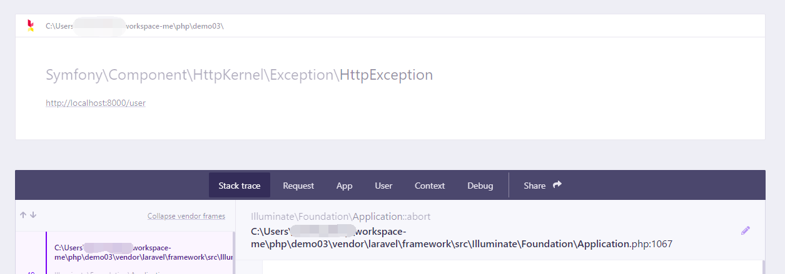
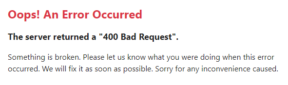
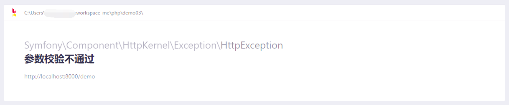
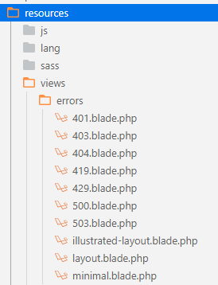

# 错误处理

这篇笔记我们介绍Laravel框架中，和错误处理相关的知识。

## 输出错误信息

调试开关决定Laravel框架返回多少错误信息到浏览器中。

我们开发的过程中，通常设置`APP_DEBUG=true`，此时如果代码运行出现异常，Laravel会给我们生成一个错误页，并打印错误描述，错误栈等信息。



如果`APP_DEBUG=false`，则不会输出详细的调试信息了。



因此发布到生产环境的env配置中，记得将调试开关关闭。

## 抛出HTTP错误

Laravel中，可以使用`abort()`函数抛出HTTP错误并中断处理流程。

例子：
```
abort(400, '参数校验不通过');
```

第一个参数为状态码，第二个参数为输出信息。



## 统一错误页

实际开发中，我们通常需要自己定义一套统一错误页。Laravel中，实现统一错误页面非常简单。

我们首先将Laravel框架自带的错误页弹出到我们的工程中：

```
php artisan vendor:publish --tag=laravel-errors
```

执行完该命令后，将在`resources/views/errors`中生成框架自带的错误页Blade模板，我们需要在其基础之上修改和添加自定义内容。例如我们要编写一个处理`HTTP 400`状态的错误页，那么增加一个`400.blade.php`就可以了。



当然，如果不打算使用Laravel的统一样式，我们直接手动创建所有错误页也是可以的。

## 异常处理器

Laravel默认在工程目录`Exceptions/Handler.php`中，定义异常处理器。异常处理器最重要的功能，就是根据异常类型，进行特定的处理。

`render()`方法中，我们可以判断传入的异常类型，来输出特定的响应。

```php
/**
    * 根据异常类型，输出HTTP响应
    *
    * @param  \Illuminate\Http\Request  $request
    * @param  \Throwable  $exception
    * @return \Symfony\Component\HttpFoundation\Response
    *
    * @throws \Throwable
    */
public function render($request, Throwable $exception)
{
    return parent::render($request, $exception);
}
```

下面例子代码中，我们统一拦截了`HttpException`，让其输出“HTTP错误”这个提示信息。这会让Laravel在响应`404`、`400`、`500`等错误时，统一使用该错误处理逻辑。

```php
public function render($request, Throwable $exception)
{
    if ($exception instanceof HttpException) {
        return response('HTTP错误');
    }

    return parent::render($request, $exception);
}
```

默认情况下，`render()`方法调用父类的处理逻辑，我们也需要在`render()`末尾调用父类方法。
