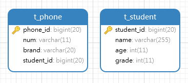
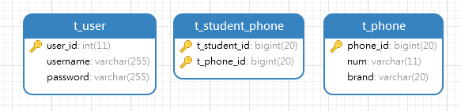

# EloquentORM 模型关联

实际开发中，我们的数据模型通常存在一对一、一对多、多对多关系，涉及ORM框架，又会产生关联单双向问题。这篇笔记，我们学习EloquentORM中如何实现模型关联和关联查询。

## 关联模型定义

### 一对一

这里我们创建了两个表，学生和手机。`Phone`和`Student`具有一对一关系，`Phone`表中包含外键`student_id`关联到Student模型。



Phone.php
```php
<?php

namespace App\Models;

use Illuminate\Database\Eloquent\Model;

class Phone extends Model
{
    protected $table = 't_phone';
    protected $primaryKey = 'phone_id';
    public $incrementing = true;
    public $timestamps = false;

    public function student() {
        return $this->hasOne('App\Models\Student', 'student_id', 'student_id');
    }
}
```

Student.php
```php
<?php

namespace App\Models;

use Illuminate\Database\Eloquent\Model;

class Student extends Model
{
    protected $table = 't_student';
    protected $primaryKey = 'student_id';
    public $incrementing = true;
    public $timestamps = false;
}
```

`Phone.php`代码中，`student()`方法就是我们定义的关联，`hasOne()`指定了一对一关联关系，其第一个参数是模型的类全名，第二个参数是关联表中的键名，第三个参数是当前表的外键名。

注：正向一对一关联应该定义在存在外键的表中。

调用一对一关联：

```php
$phone = \App\Models\Phone::find(1)->student()->first();
```

EloquentORM的数据模型支持动态属性，所以`student()`方法也可以作为一个属性来访问：

```php
$phone = \App\Models\Phone::find(1)->student;
```

该写法和上面等效。

### 反向一对一

之前的正向一对一关联中，我们能通过`Phone`访问`Student`，如果想要反过来访问，则需要再定义反向关联。

Student.php
```php
public function phone() {
    return $this->belongsTo('App\Models\Phone', 'student_id', 'student_id');
}
```

我们在`Student.php`中增加如上方法，`belongsTo()`方法能够定义反向关联，第一个参数是关联模型类全名，第二个参数是`Phone`中外键字段的名字，第三个参数是外键关联字段，也就是`Student`模型的主键值。

调用反向一对一关联：

```php
$student = \App\Models\Student::find(1)->phone()->first();
```

### 一对多

随着中国经济水平的提升，一个学生可能有多个手机，作为被老师没收后的备用。此时学生和手机就是多对多关系。

此时一对一的数据表结构不变，但是有多个`Phone`记录关联同一个`Student`记录。

```php
<?php

namespace App\Models;

use Illuminate\Database\Eloquent\Model;

class Student extends Model
{
    protected $table = 't_student';
    protected $primaryKey = 'student_id';
    public $incrementing = true;
    public $timestamps = false;

    public function phones() {
        return $this->hasMany('App\Models\Phone', 'student_id', 'student_id');
    }
}
```

注：正向一对多关联应定义在“一”的一方。

调用一对多关系：

```php
$phones = \App\Models\Student::find(1)->phones()->get();
```

### 反向一对多（多对一）

对“多”的一方来说，关联关系还是“对一”，所以这里我们还是使用`belongsTo()`。

```php
<?php

namespace App\Models;

use Illuminate\Database\Eloquent\Model;

class Phone extends Model
{
    protected $table = 't_phone';
    protected $primaryKey = 'phone_id';
    public $incrementing = true;
    public $timestamps = false;

    public function student() {
        return $this->belongsTo('App\Models\Student', 'student_id', 'student_id');
    }
}
```

调用反向一对多关系：

```php
$student = \App\Models\Phone::find(1)->student()->get();
```

### 双向多对多

同学们的手机被老师没收后，出现了手机数量的不足，此时会有一部手机多个同学玩，一个同学也可能拥有多部手机。

多对多关系需要创建关联表，这里我们创建一张关联表`t_student_phone`，并指定两个关联外键为联合主键。



```php
<?php

namespace App\Models;

use Illuminate\Database\Eloquent\Model;

class Phone extends Model
{
    protected $table = 't_phone';
    protected $primaryKey = 'phone_id';
    public $incrementing = true;
    public $timestamps = false;

    public function students() {
        return $this->belongsToMany('App\Models\Student', 't_student_phone', 'phone_id', 'student_id');
    }
}
```

```php
<?php

namespace App\Models;

use Illuminate\Database\Eloquent\Model;

class Student extends Model
{
    protected $table = 't_student';
    protected $primaryKey = 'student_id';
    public $incrementing = true;
    public $timestamps = false;

    public function phones() {
        return $this->belongsToMany('App\Models\Phone','t_student_phone', 'student_id', 'phone_id');
    }
}
```

`belongsToMany()`指定多对多关系，第一个参数是关联模型的类全名，第二个参数是关联表名，第三个参数是当前模型在关联表中的外键名，第四个参数是关联模型在关联表中的外键名。

相互关联查询：
```php
$students = \App\Models\Phone::find(2)->students()->get();
$phones = \App\Models\Student::find(4)->phones()->get();
```

### 多对多获取中间表字段

如果在多对多的数据模型中，关联关系上需要添加额外字段，那么我们的多对多中间表可能就不止包含两个外键字段了。多对多关系中，`pivot`属性可以用于访问中间表上的属性。

使用`pivot`前，首先需要在`belongsToMany()`之后用`withPivot()`指定中间表，除主键之外，我们想要访问的字段。

```php
return $this->belongsToMany('App\Models\Phone','t_student_phone', 'student_id', 'phone_id')->withPivot('relation_type');
```

该方法可以接收多个参数。

```php
public function index(Request $request)
{
    $phone_status = [];

    $student = Student::find(1);
    foreach ($student->phones as $phone) {
        array_push($phone_status, [
            'phone_num' => $phone->num,
            'phone_brand' => $phone->brand,
            'status' => $phone->pivot->relation_type
        ]);
    }
    return response()->json($phone_status);
}
```

代码中，`relation_type`是中间表`t_student_phone`中的一个非外键属性。

在取出的关联模型中，EloquentORM会自动添加一个`pivot`属性，代表关联中间表对应数据记录的模型对象，我们可以直接访问其中的字段。

## 模型操作

之前我们只介绍了关联模型的查询，这里我们再介绍如何维护关联模型的关联关系。

`save()`方法可以保存关联关系。

```php
$student = Student::find(4);
$phone = Phone::find(1);
$student->phones()->save($phone);
```
