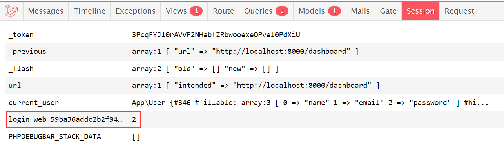

# auth-登录认证系统

Laravel框架自带了一个Auth模块，使用它能够直接生成一套基础的登录认证系统，省去我们自己再编写一遍的麻烦。这篇笔记我们介绍如何使用Auth实现注册、登录、登出等功能。

## 准备工作

Auth模块的配置文件为`config/auth.php`。其中定义的配置其实一般不需要修改，我们了解即可。此外，还需要配置数据库，这里就不多介绍了。

使用Auth前，需要运行数据迁移，生成其所需的数据表（一张用户表）。数据迁移文件在创建工程时，其实已经帮我们建好了，我们直接运行即可：

```php
php artisan migrate
```

这样，我们的数据库中就会创建一个`users`表。


## 注册

这里直接给出一个简答的注册功能例子代码。

RegisterController.php
```php
<?php

namespace App\Http\Controllers\Auth;

use App\Http\Controllers\Controller;
use Illuminate\Foundation\Auth\User;
use Illuminate\Http\Request;
use Illuminate\Support\Facades\Hash;

class RegisterController extends Controller
{
    public function register_page() {
        return view('register');
    }

    public function do_register(Request $request) {

        $request->validate([
            'username' => 'required|max:255',
            'email' => 'required|max:255',
            'password' => 'required|max:255'
        ]);

        $user = new User();
        $user->name = $request->input('username');
        $user->email = $request->input('email');
        $user->password = Hash::make($request->input('password'));
        $user->save();

        return '注册成功';
    }
}
```

代码其实非常简单，总的来说，就是实例化一个`User`模型，然后使用ORM将其保存。这里我们设定了它的三个参数：用户名、邮箱、密码，注意密码保存的内容是散列值。

register.blade.php
```html
<!DOCTYPE html>
<html lang="zh-cmn-Hans">
<head>
    <meta charset="UTF-8">
    <meta name="viewport" content="width=device-width, initial-scale=1.0">
    <meta http-equiv="X-UA-Compatible" content="ie=edge">
    <title>注册</title>
</head>
<body>
    <div>
        <form action="/register" method="post">
            @csrf
            <div>
                <label for="email">用户名</label>
                <input id="username" type="username" name="username" />
            </div>
            <div>
                <label for="email">邮箱</label>
                <input id="email" type="email" name="email" />
            </div>
            <div>
                <label for="password">密码</label>
                <input id="password" type="password" name="password" />
            </div>
            <div>
                <input type="submit" value="注册" />
                <input type="reset" value="重置" />
            </div>
        </form>
    </div>
    <div>
        @error('username')
        <div>{{ $message }}</div>
        @enderror
        @error('email')
            <div>{{ $message }}</div>
        @enderror
        @error('password')
            <div>{{ $message }}</div>
        @enderror
    </div>
</body>
</html>
```

页面包含一个表单，用来提交注册信息。

## 登录和登出

注册完成后，我们的数据表中就有数据了，下面例子代码实现了登入和登出功能：

```php
<?php

namespace App\Http\Controllers\Auth;

use App\Http\Controllers\Controller;
use Illuminate\Http\Request;
use Illuminate\Support\Facades\Auth;

class LoginController extends Controller
{
    public function login_page(Request $request)
    {
        return view('login', ['err_msg' => '']);
    }

    public function do_login(Request $request)
    {
        $request->validate([
            'username' => 'required|max:255',
            'password' => 'required|max:255',
        ]);

        $params = $request->only(['username', 'password']);
        if (
            Auth::attempt(['name' => $params['username'], 'password' => $params['password']]) ||
            Auth::attempt(['email' => $params['username'], 'password' => $params['password']])
        ) {
            session()->put('current_user', Auth::user());
            return redirect('/dashboard');
        } else {
            return view('login', ['err_msg' => '用户名或密码错误']);
        }
    }

    public function do_logout(Request $request)
    {
        Auth::logout();
        return redirect('/login');
    }
}
```

登录功能中，我们同时支持用户名登录和邮箱登录，`Auth::attempt()`支持传入多种校验组合，如果校验成功，则返回`true`，并在session中设置已登录的标志位。



这里我们也将用户信息放入了session中，便于读取使用。`Auth::user()`能够返回当前会话中，已经登录的用户。

登陆成功后，我们跳转到dashboard页面。

`Auth::logout()`则用于登出，它会清除session中的已登录标志位。

login.blade.php
```html
<!DOCTYPE html>
<html lang="zh-cmn-Hans">
<head>
    <meta charset="UTF-8">
    <meta name="viewport" content="width=device-width, initial-scale=1.0">
    <meta http-equiv="X-UA-Compatible" content="ie=edge">
    <title>登录</title>
</head>
<body>
    <div>
        <form action="/login" method="post">
            @csrf
            <label for="email">用户名或邮箱</label>
            <input id="username" type="text" name="username" />
            <label for="password">密码</label>
            <input id="password" type="password" name="password" />
            <input type="submit" value="登录" />
            <input type="reset" value="重置" />
        </form>
    </div>
    <div>
        @error('username')
            <div>{{ $message }}</div>
        @enderror
        @error('password')
            <div>{{ $message }}</div>
        @enderror
        {{ $err_msg }}
    </div>
</body>
</html>
```

dashboard.blade.php
```html
<!DOCTYPE html>
<html lang="zh-cmn-Hans">
<head>
    <meta charset="UTF-8">
    <meta name="viewport" content="width=device-width, initial-scale=1.0">
    <meta http-equiv="X-UA-Compatible" content="ie=edge">
    <title>Dashboard</title>
</head>
<body>
    <h1>Dashboard</h1>
    <p>您好，{{ session('current_user')['name'] }}</p>
    <a href="/logout">登出</a>
</body>
</html>
```

## 保护路由

上面实现注册、登录、登出功能后，还不够，我们现在其实还能直接访问`/dashboard`页面，这是不行的，我们需要Auth模块对未登录的请求进行拦截。这可以为路由配置Auth提供的中间件实现。

```php
Route::get('/login', 'Auth\LoginController@login_page')->name('login');
```

注意：使用`auth`中间件时，路由中必须配置有一个名为`login`的命名路由，当未登录被`auth`中间件拦截时，将302重定向到`/login`。

```php
Route::get('/dashboard', 'DashboardController@dashboard')->middleware(['auth']);
```

上面路由中，我们为`/dashboard`路径配置了`auth`中间件，此时改地址就无法在未登录的状态下访问了。

## Laravel内置页面

`laravel/ui`这个扩展中，包含了登录注册相关功能的页面、控制器，如果使用该扩展，我们上面的诸多代码甚至都不需要编写了，直接有现成的使用。但是我个人是十分讨厌后端框架和前端紧耦合的设计，这里就不介绍了。
