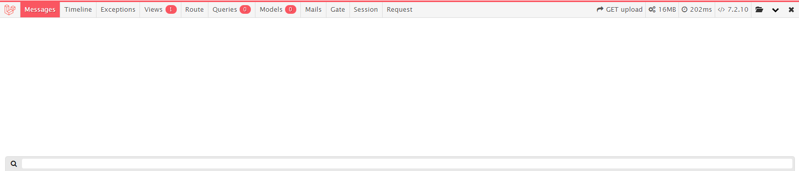
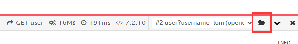
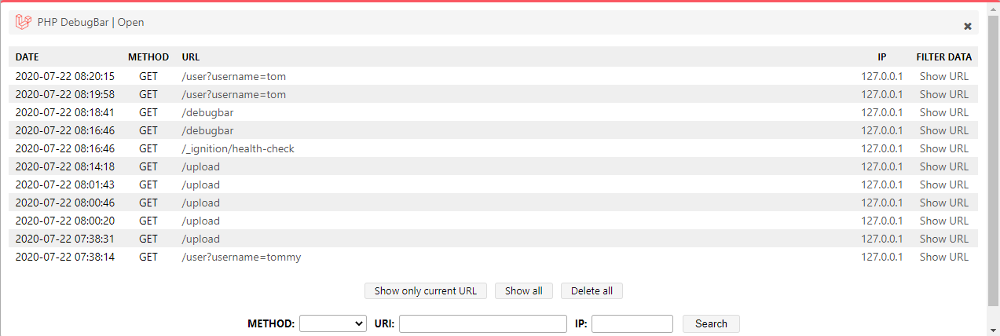

# debugbar-调试信息输出

Laravel虽然看上去很美好，但其中的一个巨坑是不支持断点调试，好在通常也没有复杂的业务系统选型Laravel。调试Laravel程序，通常有以下方式：

* `var_dump();die;`：这个是PHP中的常用调试手段，输出信息并中断处理流程，相当于一个手动断点，这里不再多做介绍了
* 输出调试信息到日志：使用Laravel提供的`Log::info()`等函数，将日志输出到日志文件中并查看

当然，查看日志文件也不是很方便，有没有更简单的办法呢？`barryvdh/laravel-debugbar`这个扩展能够在页面上生成一个额外的调试窗口，输出调试信息。

[https://github.com/barryvdh/laravel-debugbar](https://github.com/barryvdh/laravel-debugbar)

## 安装

使用`composer`安装模块：

```
composer require barryvdh/laravel-debugbar --dev
```

然后在`app.php`中配置`ServiceProvider`：

config/app.php
```php
'providers' => [
    ...
    Barryvdh\Debugbar\ServiceProvider::class,
    ...
 ],
'aliases' => [
    ...
    'Debugbar' => Barryvdh\Debugbar\Facade::class,
    ...
 ],
```

执行`artisan vendor:publish`，生成debugbar的配置文件：
```
php artisan vendor:publish --provider="Barryvdh\Debugbar\ServiceProvider"
```

该命令会生成`config/debugbar.php`配置文件。



如上配置完成后，我们就可以在任意一个视图中，查看debugbar了。

注：默认Debugbar只会出现在调试模式下。

## 输出调试信息

导入相关包：
```php
use Barryvdh\Debugbar\Facade as Debugbar;
```

输出调试信息：
```php
Debugbar::info('hello');
```

## 调试Json接口



Debugbar只会生成在Blade模板视图中，如果我们响应的内容是Json，我们就会发现Debugbar不起作用了。但Debugbar支持查看其他页面请求的调试输出，如果调试的是Json接口，我们随便找一个有Debugbar的页面，点击图中的按钮，选择相应的请求即可。



如果我们的项目完全没有页面，我们就得单独写一个空白的Blade模板页面，让Debugbar有地方渲染。以下代码是路由配置，我们配置了一个仅限于调试的页面：

```php
Route::get('/debugbar', function () {
    if (env('APP_ENV') != 'production' && env('APP_DEBUG') === true) {
        return view('debugbar');
    } else {
        abort(404);
    }
});
```
